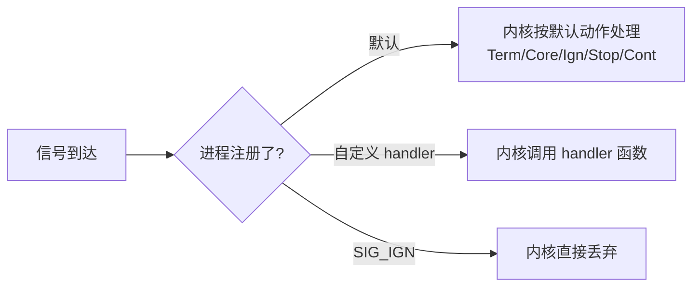
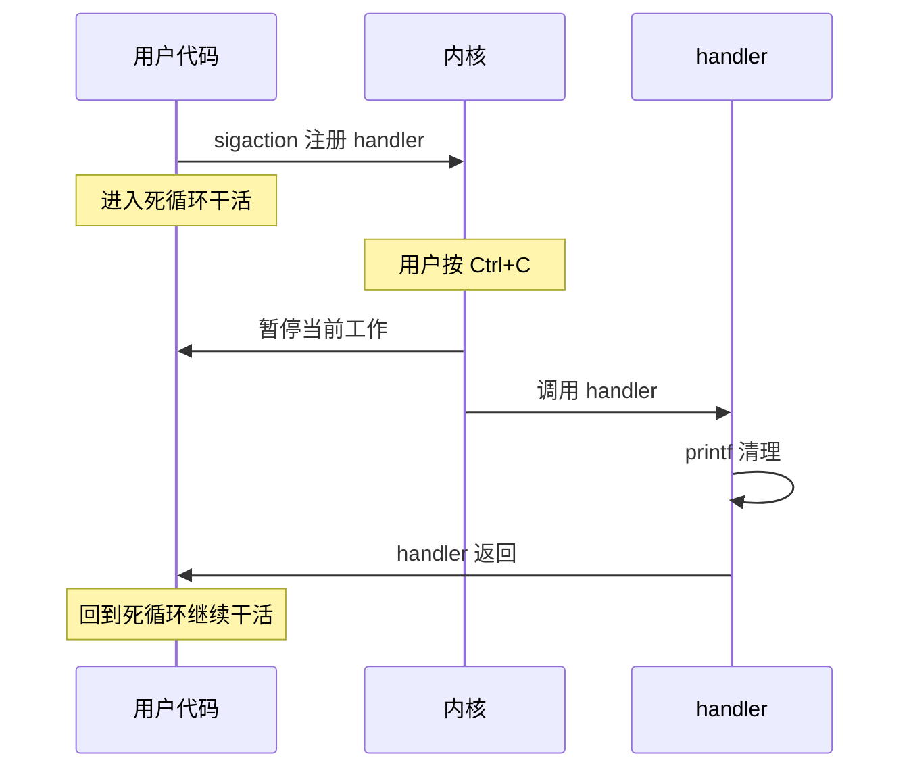
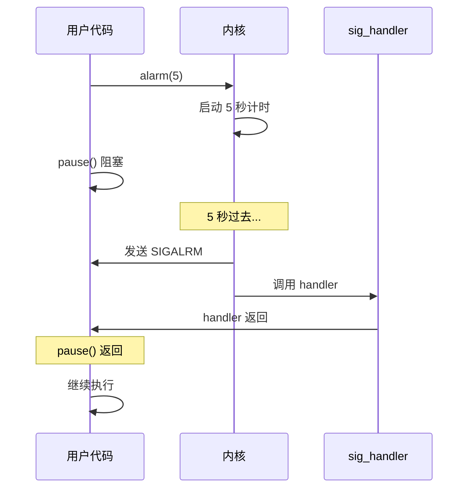
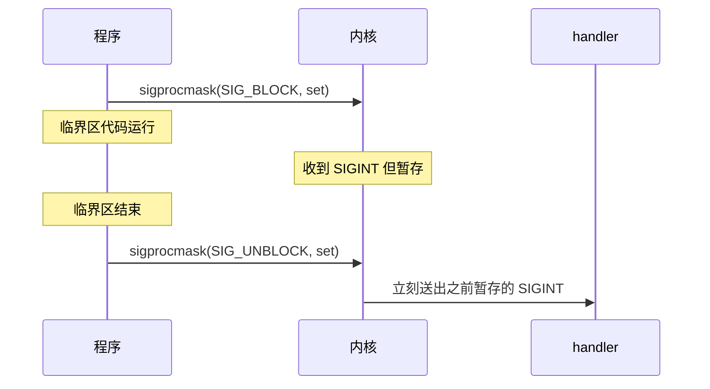
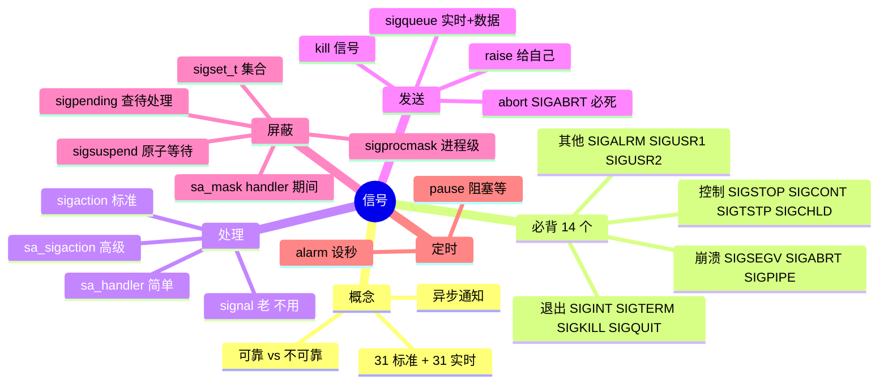

# 应用书 第 8 章 信号 学习笔记

> 何天诚 · 嵌入式 Linux 学习
> 创建时间:2026-06-08
> 对应教材:《I.MX6U 嵌入式 Linux C 应用编程指南 V1.6》第 8 章

- [应用书 第 8 章 信号 学习笔记](#应用书-第-8-章-信号-学习笔记)
  - [学习进度](#学习进度)
  - [实战代码完成](#实战代码完成)
  - [8.1 信号是什么](#81-信号是什么)
    - [进程对信号的 3 种处理方式](#进程对信号的-3-种处理方式)
    - [默认动作 5 种](#默认动作-5-种)
    - [不可改写的两个信号](#不可改写的两个信号)
  - [8.2 信号分类(可靠 vs 不可靠)](#82-信号分类可靠-vs-不可靠)
    - [类比记忆](#类比记忆)
    - [对照表](#对照表)
    - [32/33 哪去了](#3233-哪去了)
    - [不可靠的 3 个历史包袱](#不可靠的-3-个历史包袱)
    - [经典坑:SIGCHLD 丢失](#经典坑sigchld-丢失)
  - [8.3 必背的 14 个信号](#83-必背的-14-个信号)
    - [1. 终止/退出类](#1-终止退出类)
    - [2. 程序崩溃类](#2-程序崩溃类)
    - [3. 进程控制类](#3-进程控制类)
    - [4. 定时/自定义](#4-定时自定义)
    - [SIGPIPE 工程坑](#sigpipe-工程坑)
  - [8.4 信号处理(本章核心)⭐⭐⭐](#84-信号处理本章核心)
    - [signal() vs sigaction() 选哪个](#signal-vs-sigaction-选哪个)
    - [sigaction 万能模板(背!)](#sigaction-万能模板背)
    - [struct sigaction 字段](#struct-sigaction-字段)
    - [sa\_flags 唯一要记的: SA\_RESTART](#sa_flags-唯一要记的-sa_restart)
    - [信号处理工作流](#信号处理工作流)
    - [实战:三种死法对比](#实战三种死法对比)
    - [shell 杀死打印对照](#shell-杀死打印对照)
  - [8.5 信号发送(简单)](#85-信号发送简单)
    - [kill() 的 pid 参数 4 种特殊值](#kill-的-pid-参数-4-种特殊值)
    - [sig=0 的妙用(面试)](#sig0-的妙用面试)
  - [8.6 alarm + pause(定时机制)](#86-alarm--pause定时机制)
    - [alarm() — 非阻塞计时器](#alarm--非阻塞计时器)
    - [pause() — 阻塞等任意信号](#pause--阻塞等任意信号)
    - [组合用法 1: 定时退出](#组合用法-1-定时退出)
    - [组合用法 2: 自己实现 sleep](#组合用法-2-自己实现-sleep)
    - [时序图](#时序图)
    - [实战应用](#实战应用)
    - [⚠ alarm 不精确](#-alarm-不精确)
  - [8.7 信号集 sigset\_t](#87-信号集-sigset_t)
    - [5 个 API](#5-个-api)
    - [典型组合用法](#典型组合用法)
    - [这一节的位置](#这一节的位置)
  - [8.8 信号的描述(获取信号名字符串)](#88-信号的描述获取信号名字符串)
    - [handler 标准写法](#handler-标准写法)
    - [备注](#备注)
  - [8.9 信号阻塞(屏蔽)⭐⭐⭐](#89-信号阻塞屏蔽)
    - [核心概念](#核心概念)
    - [sigprocmask 三种 how](#sigprocmask-三种-how)
    - [安全模板:进入/退出临界区](#安全模板进入退出临界区)
    - [屏蔽期间信号丢不丢](#屏蔽期间信号丢不丢)
    - [屏蔽信号的 3 种途径(对比)](#屏蔽信号的-3-种途径对比)
    - [注意](#注意)
    - [三个面试金句](#三个面试金句)
  - [8.10 sigsuspend(原子等待)⭐⭐⭐](#810-sigsuspend原子等待)
    - [解决的问题(必须懂)](#解决的问题必须懂)
    - [sigsuspend 的原子性](#sigsuspend-的原子性)
    - [mask 参数的常用值](#mask-参数的常用值)
    - [标准用法模板](#标准用法模板)
    - [一句话](#一句话)
  - [8.11 实时信号:sigqueue + sigaction(SA\_SIGINFO)](#811-实时信号sigqueue--sigactionsa_siginfo)
    - [实时信号 vs 标准信号(再强调)](#实时信号-vs-标准信号再强调)
    - [发送(带数据)](#发送带数据)
    - [接收(扩展 handler)](#接收扩展-handler)
    - [siginfo\_t 常用 3 字段](#siginfo_t-常用-3-字段)
    - [sigpending(顺带讲)](#sigpending顺带讲)
  - [8.12 abort()](#812-abort)
    - [关键特性](#关键特性)
    - [用途](#用途)
    - [和 exit 对比](#和-exit-对比)
  - [全章思维导图](#全章思维导图)
  - [关键代码模板(全章总览)](#关键代码模板全章总览)
    - [模板 1: 捕获 Ctrl+C 优雅退出](#模板-1-捕获-ctrlc-优雅退出)
    - [模板 2: 服务器忽略 SIGPIPE](#模板-2-服务器忽略-sigpipe)
    - [模板 3: alarm 超时保护](#模板-3-alarm-超时保护)
    - [模板 4: 探活检测](#模板-4-探活检测)
    - [模板 5: 临界区保护(sigprocmask)](#模板-5-临界区保护sigprocmask)
    - [模板 6: 原子等待(sigsuspend)](#模板-6-原子等待sigsuspend)
    - [模板 7: 实时信号发送+接收](#模板-7-实时信号发送接收)
    - [模板 8: handler 里安全输出(异步信号安全)](#模板-8-handler-里安全输出异步信号安全)
  - [面试速查](#面试速查)
  - [踩坑大全](#踩坑大全)
    - [A. sigset\_t / API 调用类(最常踩)](#a-sigset_t--api-调用类最常踩)
      - [1. sigset\_t 声明后必须先初始化才能 addset](#1-sigset_t-声明后必须先初始化才能-addset)
      - [2. sigemptyset / sigaddset / sigprocmask 忘了 \&](#2-sigemptyset--sigaddset--sigprocmask-忘了-)
      - [3. SIG\_BLOCK / SIG\_UNBLOCK 是宏,不能加引号](#3-sig_block--sig_unblock-是宏不能加引号)
      - [4. 忘了 sigaction 注册 handler 就 sigprocmask](#4-忘了-sigaction-注册-handler-就-sigprocmask)
      - [5. struct sigaction 没 `= {0}` 初始化](#5-struct-sigaction-没--0-初始化)
    - [B. sigprocmask / sigsuspend 行为类](#b-sigprocmask--sigsuspend-行为类)
      - [6. sigprocmask 屏蔽 SIGKILL/SIGSTOP 无效](#6-sigprocmask-屏蔽-sigkillsigstop-无效)
      - [7. sigprocmask 屏蔽 ≠ 信号丢弃](#7-sigprocmask-屏蔽--信号丢弃)
      - [8. sigprocmask + pause 有时间窗口竞争](#8-sigprocmask--pause-有时间窗口竞争)
      - [9. 信号集"原始"和"恢复"用 SETMASK 不用 UNBLOCK](#9-信号集原始和恢复用-setmask-不用-unblock)
    - [C. handler 行为类](#c-handler-行为类)
      - [10. handler 里 printf 没 \\n + abort 不刷缓冲 → 输出消失](#10-handler-里-printf-没-n--abort-不刷缓冲--输出消失)
      - [11. handler 里不能用大部分函数(异步信号不安全)](#11-handler-里不能用大部分函数异步信号不安全)
      - [12. handler 跨平台行为不一致用 signal()](#12-handler-跨平台行为不一致用-signal)
      - [13. 实时信号 handler 必须用 sa\_sigaction](#13-实时信号-handler-必须用-sa_sigaction)
    - [D. 各信号特有的坑](#d-各信号特有的坑)
      - [14. raise(SIGABRT) ≠ abort()](#14-raisesigabrt--abort)
      - [15. SIGCHLD 多个合并丢失](#15-sigchld-多个合并丢失)
      - [16. SIGPIPE 默认终止(服务器必坑)](#16-sigpipe-默认终止服务器必坑)
      - [17. alarm 被信号打断重新计时](#17-alarm-被信号打断重新计时)
      - [18. 多次 alarm 覆盖](#18-多次-alarm-覆盖)
    - [E. C 语法 / 编译类(代码实测踩的)](#e-c-语法--编译类代码实测踩的)
      - [19. `pause` 没加括号不真调用](#19-pause-没加括号不真调用)
      - [20. 头文件 typo](#20-头文件-typo)
      - [21. 变量名用 `new`](#21-变量名用-new)
      - [22. printf 不加 \\n 在 sleep / pause 期间看不见](#22-printf-不加-n-在-sleep--pause-期间看不见)
    - [修改 6: "一句话总结" 补全新内容](#修改-6-一句话总结-补全新内容)
  - [一句话总结](#一句话总结)
  - [下一步](#下一步)

## 学习进度

- [x] 8.1 信号的概念
- [x] 8.2 信号的分类(可靠/不可靠)
- [x] 8.3 常见信号(20+ 个,核心 14 个)
- [x] 8.4 信号处理(signal / sigaction)⭐⭐⭐
- [x] 8.5 信号发送(kill / raise)
- [x] 8.6 alarm + pause(定时)
--[x] 8.7 信号集 sigset_t
- [x] 8.8 信号描述(strsignal/psignal)
- [x] 8.9 信号屏蔽 sigprocmask ⭐⭐⭐
- [x] 8.10 sigsuspend(原子等待)⭐⭐⭐
- [x] 8.11 实时信号 sigqueue + SA_SIGINFO
- [x] 8.12 abort()

## 实战代码完成

| # | 文件 | 验证了什么 |
|---|------|----------|
| 01 | ch08/01_catch_sigint.c | sigaction 拦截 + 三种死法 |
| 02 | ch08/02_alarm_demo.c | alarm 定时退出 |
| 03 | ch08/03_block_signal.c | sigprocmask 屏蔽暂存 |
| 04 | ch08/04_sigsuspend.c | 原子等待,信号不丢 |
| 05 | ch08/05_realtime_signal.c | 实时信号排队 + 带数据 |
| 06 | ch08/06_abort_test.c | abort vs raise 本质差别 |

> **本章定位**:**秋招面试硬核章节**。signal handler + sigaction + alarm + 信号集组合起来,是面试官最爱问的"异步编程"基础。**驱动开发里用户态用 SIGIO 异步通知驱动事件,也是这一套**。

---

## 8.1 信号是什么

信号 = **进程间异步通信机制**,类比"敲门"或"广播"。

特点:
- **异步** —— 你不知道啥时候来,但来了就要处理
- **有限种类** —— 1~31 是标准信号,34~64 是实时信号
- **不能传太多数据** —— 只能传"信号编号"(实时信号可以附带 1 个 int 或指针)

来源:
- **用户操作** —— Ctrl+C(SIGINT)、Ctrl+\(SIGQUIT)、Ctrl+Z(SIGTSTP)
- **kill 命令** —— `kill -9 PID`、`kill PID`
- **内核检测异常** —— 段错误(SIGSEGV)、除零(SIGFPE)
- **定时器** —— alarm 到时(SIGALRM)
- **其他进程** —— 用 kill() 发送

### 进程对信号的 3 种处理方式



### 默认动作 5 种

| 缩写 | 含义 |
|------|------|
| **term** | 终止进程 |
| **term+core** | 终止 + 生成 core dump(可 gdb 调试) |
| **ignore** | 内核丢弃,啥都不做 |
| **stop** | 暂停进程(可恢复) |
| **cont** | 让暂停的进程继续 |

### 不可改写的两个信号

- **SIGKILL (9)** —— 强杀,不能捕获、不能忽略、不能阻塞
- **SIGSTOP (19)** —— 强暂停,同上

这是内核留的"杀手锏",保证流氓程序永远能被干掉。

---

## 8.2 信号分类(可靠 vs 不可靠)

### 类比记忆

- **不可靠信号** = 门铃 🔔 (多次按只响 1 次,会丢)
- **可靠信号** = 语音留言 📬 (每条都排队,1 条不丢)

### 对照表

| 维度 | 不可靠信号(1-31) | 可靠信号(34-64) |
|------|----------------|-----------------|
| 名字 | 标准信号 / UNIX 信号 | 实时信号 / POSIX 信号 |
| **排队** | ❌ 多次合并成 1 次 | ✅ 全部排队 |
| **数据** | ❌ 只能传信号号 | ✅ 可附 int 或指针 |
| **顺序** | ❌ 不保证 | ✅ 保证 |
| **发送 API** | `kill(pid, sig)` | `sigqueue(pid, sig, value)` |
| **内核存储** | 一个 32 位 bitmap(1 个 bit/信号) | 队列链表 |
| 编号 | 1~31 | SIGRTMIN~SIGRTMAX(34~64) |

### 32/33 哪去了

被 glibc 内部用了(NPTL 线程库实现),用户可用 31 个实时信号(34~64)。

### 不可靠的 3 个历史包袱

1. handler 跑完**自动恢复默认动作** → 必须每次重新注册(sigaction 修复)
2. **不排队** → 多次信号合并丢失(实时信号修复)
3. handler 中**信号未屏蔽** → 可能被同信号嵌套打断(sigaction 修复)

### 经典坑:SIGCHLD 丢失

父进程同时启动 10 个子进程,几乎同时结束 → 10 个 SIGCHLD 到达 → **被合并成 1~2 个** → 父进程只回收 1~2 个 → **8~9 个僵尸进程残留**。

**修复**: handler 里循环 `waitpid(-1, &status, WNOHANG)` 直到返回 0,**不能假设"信号数 = 子进程数"**。(8.7+ 节细讲)

---

## 8.3 必背的 14 个信号

按用途分 4 组背:

### 1. 终止/退出类

| 信号 | 编号 | 触发 | 默认 |
|------|------|------|------|
| **SIGINT** | 2 | Ctrl+C | term |
| **SIGQUIT** | 3 | Ctrl+\ | term+core |
| **SIGKILL** | 9 | `kill -9` | term **(不可捕获)** |
| **SIGTERM** | 15 | `kill` 默认 | term |

### 2. 程序崩溃类

| 信号 | 编号 | 触发 | 默认 |
|------|------|------|------|
| **SIGSEGV** | 11 | 段错误(空指针/越界) | term+core |
| **SIGABRT** | 6 | abort() 调用 | term+core |
| **SIGPIPE** | 13 | 写已关闭的管道/socket | **term(坑!)** |

### 3. 进程控制类

| 信号 | 编号 | 触发 | 默认 |
|------|------|------|------|
| **SIGSTOP** | 19 | 强制暂停 | stop **(不可捕获)** |
| **SIGCONT** | 18 | 让暂停的继续 | cont |
| **SIGTSTP** | 20 | Ctrl+Z | stop |
| **SIGCHLD** | 17 | 子进程结束 | **ignore** |

### 4. 定时/自定义

| 信号 | 编号 | 触发 |
|------|------|------|
| **SIGALRM** | 14 | alarm 定时到 |
| **SIGUSR1** | 10 | 用户自定义 1 |
| **SIGUSR2** | 12 | 用户自定义 2 |

### SIGPIPE 工程坑

写一个对面关掉的 socket → 收到 SIGPIPE → **默认终止你的服务器进程**!

**修复**: 服务器启动时一句话:
```c
signal(SIGPIPE, SIG_IGN);   // 忽略 SIGPIPE,让 write 返回 -1 + EPIPE
```

---

## 8.4 信号处理(本章核心)⭐⭐⭐

### signal() vs sigaction() 选哪个

- `signal()` 是历史包袱,不同 UNIX 系统行为不一致
- **`sigaction()` 是 POSIX 标准**,跨平台一致,**现代代码全用这个**

### sigaction 万能模板(背!)

```c
#include <signal.h>
#include <stdio.h>
#include <unistd.h>

void my_handler(int sig)
{
    printf("收到信号 %d\n", sig);
    // 这里做清理 / 退出 / 重新加载配置等
}

int main(void)
{
    struct sigaction sa;
    sa.sa_handler = my_handler;       // 我的回调
    sigemptyset(&sa.sa_mask);          // 清空屏蔽集(handler 中不额外屏蔽)
    sa.sa_flags = 0;                   // 默认行为
    
    sigaction(SIGINT, &sa, NULL);      // 给 SIGINT 注册
    
    while (1) {
        printf("running...\n");
        sleep(1);
    }
    return 0;
}
```

### struct sigaction 字段

```c
struct sigaction {
    void (*sa_handler)(int);                    // ⭐ 你的回调
    void (*sa_sigaction)(int, siginfo_t*, void*);// 高级版回调(初学跳过)
    sigset_t sa_mask;                            // handler 中屏蔽哪些信号
    int      sa_flags;                           // 行为开关
    void (*sa_restorer)(void);                   // 别管,内部用
};
```

**初学 99% 只用 2 个字段**:`sa_handler` 和 `sa_flags`。

### sa_flags 唯一要记的: SA_RESTART

如果不设 SA_RESTART:
```c
read(fd, buf, 100);   // 阻塞等数据
// 此时来一个信号,handler 跑完后,read 返回 -1, errno=EINTR
// 你要自己判 errno 重试,烦
```

设了 SA_RESTART:
```c
sa.sa_flags = SA_RESTART;
// 信号打断后内核自动重启 read,你感受不到
```

**工程代码几乎所有 handler 都加 SA_RESTART**。

### 信号处理工作流



### 实战:三种死法对比

测试代码(ch08/01_catch_sigint.c)注册了 SIGINT handler。三种命令杀它:

| 命令 | 信号 | 结果 |
|------|------|------|
| Ctrl+C 或 `kill -2 PID` | SIGINT (2) | **被 handler 拦下,不死**,打印"收到信号 2" |
| `kill PID` | SIGTERM (15) | **直接死**(没注册 SIGTERM handler,用默认 term) |
| `kill -9 PID` | SIGKILL (9) | **瞬间死**,shell 打印 `Killed` |

### shell 杀死打印对照

| 信号杀死 | shell 显示 |
|---------|-----------|
| SIGKILL | `Killed` |
| SIGSEGV | `Segmentation fault (core dumped)` |
| SIGABRT | `Aborted` |
| SIGBUS | `Bus error` |
| SIGFPE | `Floating point exception` |

---

## 8.5 信号发送(简单)

3 个函数,全是命令行 `kill` 的 C 版本:

```c
kill(pid, sig);        // 发信号给某个 PID
raise(sig);            // 发给自己,等价 kill(getpid(), sig)
killpg(pgrp, sig);     // 发给整个进程组
```

### kill() 的 pid 参数 4 种特殊值

| pid | 行为 |
|-----|------|
| 正数 | 发给这个 PID |
| **0** | 发给和自己同进程组的所有进程 |
| **-1** | 发给所有进程(除了 init) |
| 负数 | 发给进程组 ID = `-pid` 的所有进程 |

### sig=0 的妙用(面试)

```c
if (kill(pid, 0) == 0) {
    // 进程存在
} else if (errno == ESRCH) {
    // 进程不存在
}
```

**用途**: 探测某个 PID 是否还活着,**不实际发信号**。

---

## 8.6 alarm + pause(定时机制)

### alarm() — 非阻塞计时器

```c
unsigned int alarm(unsigned int seconds);
```

- 告诉内核 `seconds` 秒后发 SIGALRM 给我
- **立刻返回**,不阻塞
- `alarm(0)` 取消之前设的闹钟,返回剩余秒数
- 同一进程只能有 1 个 alarm,新 alarm 覆盖旧的

### pause() — 阻塞等任意信号

```c
int pause(void);
```

- **阻塞**直到收到任意信号
- 收到信号 → handler 跑完 → pause 返回 -1, errno=EINTR

### 组合用法 1: 定时退出

```c
void on_alarm(int sig) {
    puts("Timeout");
    exit(0);                    // ← handler 里 exit,程序自动结束
}

sigaction(SIGALRM, &sa, NULL);
alarm(5);
for (;;) do_work();             // 死循环干活
// 5 秒后 SIGALRM → handler → exit
```

### 组合用法 2: 自己实现 sleep

```c
void noop(int sig) {}           // 啥也不干的 handler

void my_sleep(unsigned int s) {
    struct sigaction sa = {0};
    sa.sa_handler = noop;
    sigaction(SIGALRM, &sa, NULL);
    alarm(s);
    pause();                    // 阻塞等 SIGALRM
}
```

**这就是 sleep() 的内部实现思路**。

### 时序图


### 实战应用

| 场景 | 用法 |
|------|------|
| 防止程序卡死 | alarm(30) 保护 + 任务完成后 alarm(0) 取消 |
| 限时输入 | alarm(10) + fgets,超时自动退出 |
| 软看门狗 | handler 里检测 + 重设 alarm |

### ⚠ alarm 不精确

alarm() 精度是**秒**,且收到信号会被打断重新计时。
**精确定时**用 `setitimer()` / `timer_create()` / `timerfd_create()`(8.x 节有讲)。

---


---

## 8.7 信号集 sigset_t

**本质**: 装"信号编号"的集合,给后面 sigprocmask/sigsuspend 等用。

### 5 个 API

```c
sigset_t set;

sigemptyset(&set);            // {} 清空
sigfillset(&set);             // {1~64} 装满
sigaddset(&set, SIGINT);      // 加入一个
sigdelset(&set, SIGINT);      // 删除一个
sigismember(&set, SIGINT);    // 1=在,0=不在
```

**铁律**: `sigset_t` 声明后必须 `sigemptyset` / `sigfillset` 初始化,不能直接 add。

### 典型组合用法

```c
// 1. 屏蔽所有信号,除了 SIGKILL
sigset_t set;
sigfillset(&set);                       // 全集
// 不需要删 SIGKILL,因为 SIGKILL 本来就不能屏蔽

// 2. 只屏蔽 SIGINT 和 SIGTERM
sigset_t set;
sigemptyset(&set);
sigaddset(&set, SIGINT);
sigaddset(&set, SIGTERM);

// 3. 用作 sigaction 的 sa_mask
struct sigaction sa;
sa.sa_handler = handler;
sigemptyset(&sa.sa_mask);               // handler 中不额外屏蔽信号
sa.sa_flags = SA_RESTART;
```

### 这一节的位置


8.7 本身是工具,真正"用 sigset_t 做事"在后面:
- **8.9 信号屏蔽**:`sigprocmask(SIG_BLOCK, &set, NULL)`
- **sigaction 的 sa_mask 字段**(8.4)
- **8.10 sigsuspend** 原子等待
- **8.11 sigpending** 查待处理集


## 8.8 信号的描述(获取信号名字符串)

把信号编号 → 人类可读字符串,3 种方式:

| 方式 | 用法 | 特点 |
|------|------|------|
| `sys_siglist[sig]` | 数组查询 | 简洁,非法编号会越界 |
| `strsignal(sig)` | 函数返回 char* | 安全,非法编号返回 "Unknown signal" |
| `psignal(sig, prefix)` | 自动打印到 stderr | 最方便,自带冒号+换行 |

### handler 标准写法

```c
void handler(int sig) {
    psignal(sig, "Received");   // "Received: Interrupt"
}
```

或:
```c
fprintf(stderr, "Got %d (%s)\n", sig, strsignal(sig));
```

### 备注

需要 `extern const char *const sys_siglist[]` 或 `#define _GNU_SOURCE` 才能用 sys_siglist。

## 8.9 信号阻塞(屏蔽)⭐⭐⭐

### 核心概念

屏蔽 = "信号到了,内核先存着,**不送给我的 handler**,等我解除屏蔽再送"。



### sigprocmask 三种 how

```c
sigprocmask(SIG_BLOCK, &set, NULL);     // 加屏蔽
sigprocmask(SIG_UNBLOCK, &set, NULL);   // 解屏蔽
sigprocmask(SIG_SETMASK, &set, NULL);   // 替换整个屏蔽集
```

### 安全模板:进入/退出临界区

```c
sigset_t block, old;
sigemptyset(&block);
sigaddset(&block, SIGINT);
sigaddset(&block, SIGTERM);

sigprocmask(SIG_BLOCK, &block, &old);   // 屏蔽,保存旧的
// ↓ 临界区
critical_section();
// ↑
sigprocmask(SIG_SETMASK, &old, NULL);   // 恢复旧屏蔽集(比 UNBLOCK 安全)
```

### 屏蔽期间信号丢不丢

| 信号类型 | 屏蔽期间多次发送 | 解除时收到 |
|---------|---------------|-----------|
| 标准信号 1-31 | 合并 | **1 次** |
| 实时信号 34-64 | 排队 | **全部按顺序** |

### 屏蔽信号的 3 种途径(对比)

| 方式 | 屏蔽期间 |
|------|--------|
| `sigaction 的 sa_mask` | **只在 handler 执行期间** |
| `SA_NODEFER` flag | 反向:**handler 中也允许同信号嵌套** |
| `sigprocmask()` | **手动控制,任意时段** |

### 注意

`SIGKILL` 和 `SIGSTOP` **不能被屏蔽**——sigprocmask 不会报错,但内核默默忽略。


### 三个面试金句

1. "怎么保护一段代码不被信号打断?" → sigprocmask 屏蔽 + 出临界区解除
2. "屏蔽期间信号会丢吗?" → 标准信号合并丢,实时信号全部排队
3. "为啥用 SIG_SETMASK + old_set 恢复而不是 SIG_UNBLOCK?" → 不破坏外层调用者的屏蔽设置


## 8.10 sigsuspend(原子等待)⭐⭐⭐

### 解决的问题(必须懂)

朴素写法存在竞争:
```c
sigprocmask(SIG_SETMASK, &mask, &old);   // ① 改掩码
                                          // ⚠ 时间窗口:信号可能在这里溜走
pause();                                  // ② 等信号
sigprocmask(SIG_SETMASK, &old, NULL);    // ③ 恢复
```

**bug**: ① 和 ② 中间,信号可能恰好到达 → handler 跑完 → 信号已"用掉" → pause 永远等不到。

### sigsuspend 的原子性

```c
sigsuspend(&mask);
```

**内核保证 3 件事不可分割**:
1. 临时把掩码替换成 `mask`
2. 挂起进程等信号
3. 收到信号 → handler 跑 → 恢复原掩码 → 返回

**无时间窗口,信号绝不丢失**。

### mask 参数的常用值

| mask | 含义 |
|------|------|
| 空集(sigemptyset) | 等任意信号(最常用) |
| 包含某信号 | sigsuspend 期间继续屏蔽这些 |

### 标准用法模板

```c
sigset_t block, old, wait;

// 准备掩码集
sigemptyset(&block);
sigaddset(&block, SIGUSR1);
sigemptyset(&wait);             // 等待时不屏蔽任何信号

// 外层屏蔽 SIGUSR1
sigprocmask(SIG_BLOCK, &block, &old);

while (1) {
    // 处理数据(SIGUSR1 此时被暂存)
    process();
    
    // 原子地"解屏蔽 + 睡眠 + 等信号"
    sigsuspend(&wait);
    // 唤醒后掩码自动恢复为 block(SIGUSR1 又被屏蔽)
}

sigprocmask(SIG_SETMASK, &old, NULL);
```

### 一句话

> sigsuspend = `sigprocmask + pause` 的原子版,**消除时间窗口**。


## 8.11 实时信号:sigqueue + sigaction(SA_SIGINFO)

### 实时信号 vs 标准信号(再强调)

| | 标准 1-31 | 实时 34-64 |
|---|---------|-----------|
| 排队 | ❌ 合并 | ✅ 全保留 |
| 带数据 | ❌ | ✅ 一个 int 或 ptr |
| 发送 | kill | **sigqueue** |
| 接收 | sa_handler | **sa_sigaction + SA_SIGINFO** |

### 发送(带数据)

```c
union sigval val;
val.sival_int = 100;
sigqueue(pid, SIGRTMIN, val);
```

### 接收(扩展 handler)

```c
void handler(int sig, siginfo_t *info, void *ctx) {
    int v = info->si_value.sival_int;
    pid_t from = info->si_pid;
    printf("收到 %d (来自 PID %d, 值 %d)\n", sig, from, v);
}

struct sigaction sa = {0};
sa.sa_sigaction = handler;           // 不是 sa_handler!
sa.sa_flags = SA_SIGINFO;            // 必须!
sigaction(SIGRTMIN, &sa, NULL);
```

### siginfo_t 常用 3 字段

```c
info->si_signo            // 哪个信号
info->si_pid              // 谁发的
info->si_value.sival_int  // 带的数据(int)
info->si_value.sival_ptr  // 或指针
```

### sigpending(顺带讲)

查待处理信号集(屏蔽期间攒下的):
```c
sigset_t pending;
sigpending(&pending);
if (sigismember(&pending, SIGINT)) { ... }
```

---

## 8.12 abort()

```c
void abort(void);     // 给自己发 SIGABRT,必死
```

### 关键特性

即使捕获 SIGABRT,abort 仍然杀死进程——内核会**重置 handler 为默认**然后再触发。

### 用途

- `assert()` 失败 → 调 abort
- 程序检测到内部状态不一致 → abort 留下 core dump 给 gdb 调试

### 和 exit 对比

| | exit(n) | abort() |
|---|--------|---------|
| 退出方式 | 正常 | 信号 SIGABRT |
| 缓冲刷新 | 是 | 是 |
| atexit 调用 | 是 | 否 |
| core dump | 否 | **是** |
| 用途 | 正常退出 | 错误现场快照 |


## 全章思维导图



**位置建议**: 放到"面试速查"之前,作为全章视觉总结。


## 关键代码模板(全章总览)

### 模板 1: 捕获 Ctrl+C 优雅退出

```c
volatile int running = 1;

void on_sigint(int sig) { running = 0; }

int main(void) {
    struct sigaction sa = {0};
    sa.sa_handler = on_sigint;
    sa.sa_flags = SA_RESTART;
    sigaction(SIGINT, &sa, NULL);
    
    while (running) do_work();
    cleanup();
    return 0;
}
```

### 模板 2: 服务器忽略 SIGPIPE

```c
signal(SIGPIPE, SIG_IGN);
```

### 模板 3: alarm 超时保护

```c
alarm(30);
heavy_work();
alarm(0);
```

### 模板 4: 探活检测

```c
if (kill(pid, 0) == 0) puts("alive");
else if (errno == ESRCH) puts("dead");
```

### 模板 5: 临界区保护(sigprocmask)

```c
sigset_t block, old;
sigfillset(&block);
sigprocmask(SIG_BLOCK, &block, &old);
critical_section();
sigprocmask(SIG_SETMASK, &old, NULL);
```

### 模板 6: 原子等待(sigsuspend)

```c
sigset_t block, old, wait;
sigemptyset(&block);
sigaddset(&block, SIGUSR1);
sigemptyset(&wait);

sigprocmask(SIG_BLOCK, &block, &old);
while (work_pending) {
    process();
    sigsuspend(&wait);   // 原子解屏蔽 + 等
}
sigprocmask(SIG_SETMASK, &old, NULL);
```

### 模板 7: 实时信号发送+接收

```c
// 发送端
union sigval val = { .sival_int = 42 };
sigqueue(target_pid, SIGRTMIN, val);

// 接收端
void handler(int sig, siginfo_t *info, void *ctx) {
    int v = info->si_value.sival_int;
    pid_t from = info->si_pid;
}
struct sigaction sa = {0};
sa.sa_sigaction = handler;
sa.sa_flags = SA_SIGINFO;
sigaction(SIGRTMIN, &sa, NULL);
```

### 模板 8: handler 里安全输出(异步信号安全)

```c
#include <string.h>
void handler(int sig) {
    const char msg[] = "got signal\n";
    write(STDERR_FILENO, msg, sizeof(msg) - 1);   // 不走 stdio,绕开缓冲
}
```
---
## 面试速查

- [ ] SIGINT / SIGTERM / SIGKILL 各自触发方式和能否捕获
- [ ] signal() 和 sigaction() 为什么推荐后者(行为一致 + 功能强)
- [ ] handler 函数有哪些限制(异步信号安全)
- [ ] 可靠信号 vs 不可靠信号区别(排队 / 数据 / 顺序)
- [ ] SIGCHLD 丢失原因和解决(waitpid 循环回收)
- [ ] SIGPIPE 默认行为和服务器为啥忽略
- [ ] alarm + pause 怎么实现 sleep
- [ ] kill(pid, 0) 干嘛用(探活)
- [ ] sa_flags 的 SA_RESTART 作用(信号打断 syscall 自动重启)

---

## 踩坑大全

按类别分组,刷代码时按这个清单自查。

### A. sigset_t / API 调用类(最常踩)

#### 1. sigset_t 声明后必须先初始化才能 addset

```c
sigset_t set;
sigaddset(&set, SIGINT);     // ❌ set 内容是栈上垃圾值
```

修复:
```c
sigset_t set;
sigemptyset(&set);            // ✓ 先清空
sigaddset(&set, SIGINT);
```

#### 2. sigemptyset / sigaddset / sigprocmask 忘了 &

```c
sigemptyset(set);             // ❌
sigaddset(set, SIGINT);       // ❌
sigprocmask(SIG_BLOCK, set, NULL);   // ❌
```

修复:全部加 `&`(这几个函数都要的是指针)。

#### 3. SIG_BLOCK / SIG_UNBLOCK 是宏,不能加引号

```c
sigprocmask("SIG_UNBLOCK, &set, NULL");   // ❌ 整个参数列表变字符串
```

修复:
```c
sigprocmask(SIG_UNBLOCK, &set, NULL);     // ✓
```

#### 4. 忘了 sigaction 注册 handler 就 sigprocmask

```c
void my_handler(int sig) { ... }   // 写了 handler
sigprocmask(SIG_BLOCK, &set, NULL);
// ⚠ 没 sigaction!handler 永远不会被调用
```

修复:**先 sigaction 注册,再 sigprocmask**。

#### 5. struct sigaction 没 `= {0}` 初始化

```c
struct sigaction sa;          // ⚠ 局部变量,sa_flags / sa_mask 是垃圾值
sa.sa_handler = handler;
sigaction(SIGINT, &sa, NULL); // 可能用上垃圾 flag
```

修复:
```c
struct sigaction sa = {0};    // ✓ 整体清零
```

### B. sigprocmask / sigsuspend 行为类

#### 6. sigprocmask 屏蔽 SIGKILL/SIGSTOP 无效

```c
sigaddset(&set, SIGKILL);
sigprocmask(SIG_BLOCK, &set, NULL);   // 不报错,但 SIGKILL 仍能杀你
```

内核默默忽略对这两个的屏蔽请求。

#### 7. sigprocmask 屏蔽 ≠ 信号丢弃

- **屏蔽**: 内核暂存,解除瞬间送达
- **忽略 SIG_IGN**: 内核直接丢
- 不要混淆!

#### 8. sigprocmask + pause 有时间窗口竞争

```c
sigprocmask(SIG_SETMASK, &mask, &old);
// ⚠ 这里信号可能溜走 → pause 永远等不到
pause();
```

修复:`sigsuspend(&mask)` 原子完成。

#### 9. 信号集"原始"和"恢复"用 SETMASK 不用 UNBLOCK

```c
sigprocmask(SIG_BLOCK, &block, &old);   // 保存原始 mask 到 old
// ...
sigprocmask(SIG_UNBLOCK, &old, NULL);   // ❌ UNBLOCK 不对!
```

修复:
```c
sigprocmask(SIG_SETMASK, &old, NULL);   // ✓ 用 SETMASK 直接替换
```

否则会破坏外层调用者的屏蔽设置。

### C. handler 行为类

#### 10. handler 里 printf 没 \n + abort 不刷缓冲 → 输出消失

```c
void handler(int sig) {
    printf("got %d", sig);     // ❌ 没 \n,行缓冲
}
abort();                        // abort 不刷缓冲 → 上面那行永远看不到
```

修复:加 `\n`,或用 `write(STDERR_FILENO, ...)` 绕开 stdio。

#### 11. handler 里不能用大部分函数(异步信号不安全)

handler 里能用的列表见 `man 7 signal-safety`,主要是:
- `_exit`, `abort`, `kill`, `raise`
- `write`, `read`, `open`, `close`
- `signal`, `sigaction`, `sigprocmask`
- `getpid`, `getppid`, `setsid`

**不能用**:
- `printf` / `puts`(内部有锁,可能死锁)
- `malloc` / `free`(同上)
- `exit`(应该用 `_exit`)

**实战做法**: handler 里**只设标志位**,主循环检查标志做事。

#### 12. handler 跨平台行为不一致用 signal()

老 BSD: handler 跑完保持注册
老 System V: handler 跑完恢复默认
→ **用 sigaction 一了百了**

#### 13. 实时信号 handler 必须用 sa_sigaction

```c
sa.sa_handler = handler;     // ❌ 拿不到 si_value 等数据
sa.sa_flags = SA_SIGINFO;
```

修复:
```c
sa.sa_sigaction = handler;   // ✓ 配合 SA_SIGINFO,handler 签名也变
sa.sa_flags = SA_SIGINFO;
```

handler 签名: `void handler(int sig, siginfo_t *info, void *ctx)`。

### D. 各信号特有的坑

#### 14. raise(SIGABRT) ≠ abort()

```c
raise(SIGABRT);   // 发信号 → handler 跑 → 返回 → 继续运行
abort();          // 发信号 → handler 跑 → 复位 handler → 再发 → 必死
```

abort 设计就是"保证死",和普通 kill -6 不同。**面试常考**。

#### 15. SIGCHLD 多个合并丢失

父进程同时启动 10 个子,几乎同时结束 → 10 个 SIGCHLD 被合并成 1~2 个 → 父只回收 1~2 个 → **僵尸进程**。

修复:handler 里循环 `waitpid(-1, &status, WNOHANG)` 直到返回 0。

#### 16. SIGPIPE 默认终止(服务器必坑)

写已关闭的 socket → 内核发 SIGPIPE → 默认 term → 服务器死。

修复:程序启动 `signal(SIGPIPE, SIG_IGN);`,让 write 返回 -1 + EPIPE。

#### 17. alarm 被信号打断重新计时

alarm 中途收到其他信号,handler 跑完,alarm 剩余时间重算。
**精确定时用 setitimer / timer_create / timerfd**。

#### 18. 多次 alarm 覆盖

```c
alarm(10);
alarm(5);    // ← 前面那个被取消,只剩 5 秒
```

### E. C 语法 / 编译类(代码实测踩的)

#### 19. `pause` 没加括号不真调用

```c
for(;;)
    pause;     // ⚠ 仅求函数地址,不阻塞 → 100% CPU 死循环
```

修复:
```c
for(;;)
    pause();   // ✓ 真调用
```

#### 20. 头文件 typo

`<uistd.h>` ❌ → `<unistd.h>` ✓

`<signal.h>` 不能漏(sigaction、SIGALRM、struct sigaction 等都在这)。
`<unistd.h>` 不能漏(alarm、sleep、pause、fork、getpid 等)。

#### 21. 变量名用 `new`

C 里合法,**C++ 里是关键字**——养成不用的习惯,改成 `block`、`block_set` 等更清晰。

#### 22. printf 不加 \n 在 sleep / pause 期间看不见

stdout 行缓冲,无 \n 不刷 → 信息卡在缓冲区,程序卡死时根本看不到。
**调试输出用 `puts`(自动 \n)或 `fprintf(stderr, ...)`(无缓冲)**。

### 修改 6: "一句话总结" 补全新内容
找到:
```markdown
> **信号 = 异步打断的"敲门"机制。**
>
> **sigaction 注册 handler,kill 发送,alarm 定时,handler 里只设标志位。**
>
> **SIGKILL 和 SIGSTOP 是内核杀手锏,改不了。**
补一段:

> **信号 = 异步打断的"敲门"机制。**
>
> **sigaction 注册 handler,kill 发送,alarm 定时,handler 里只设标志位。**
>
> **sigprocmask 屏蔽临界区,sigsuspend 原子等待,实时信号 sigqueue 带数据。**
>
> **SIGKILL 和 SIGSTOP 是内核杀手锏,改不了。**
---

## 一句话总结

> **信号 = 异步打断的"敲门"机制。**
>
> **sigaction 注册 handler,kill 发送,alarm 定时,handler 里只设标志位。**
>
> **SIGKILL 和 SIGSTOP 是内核杀手锏,改不了。**

---

## 下一步

第 8 章学完 ✅。继续应用书:

- [ ] 第 9 章 进程 ⭐⭐⭐(秋招必考:fork / exec / wait / 僵尸 / 守护进程)
- [ ] 第 10 章 进程间通信 IPC
- [ ] 第 11-12 章 线程 + 同步 ⭐⭐⭐
- [ ] 第 13-14 章 网络编程- [应用书 第 8 章 信号 学习笔记](#应用书-第-8-章-信号-学习笔记)
  - [学习进度](#学习进度)
  - [8.1 信号是什么](#81-信号是什么)
    - [进程对信号的 3 种处理方式](#进程对信号的-3-种处理方式)
    - [默认动作 5 种](#默认动作-5-种)
    - [不可改写的两个信号](#不可改写的两个信号)
  - [8.2 信号分类(可靠 vs 不可靠)](#82-信号分类可靠-vs-不可靠)
    - [类比记忆](#类比记忆)
    - [对照表](#对照表)
    - [32/33 哪去了](#3233-哪去了)
    - [不可靠的 3 个历史包袱](#不可靠的-3-个历史包袱)
    - [经典坑:SIGCHLD 丢失](#经典坑sigchld-丢失)
  - [8.3 必背的 14 个信号](#83-必背的-14-个信号)
    - [1. 终止/退出类](#1-终止退出类)
    - [2. 程序崩溃类](#2-程序崩溃类)
    - [3. 进程控制类](#3-进程控制类)
    - [4. 定时/自定义](#4-定时自定义)
    - [SIGPIPE 工程坑](#sigpipe-工程坑)
  - [8.4 信号处理(本章核心)⭐⭐⭐](#84-信号处理本章核心)
    - [signal() vs sigaction() 选哪个](#signal-vs-sigaction-选哪个)
    - [sigaction 万能模板(背!)](#sigaction-万能模板背)
    - [struct sigaction 字段](#struct-sigaction-字段)
    - [sa\_flags 唯一要记的: SA\_RESTART](#sa_flags-唯一要记的-sa_restart)
    - [信号处理工作流](#信号处理工作流)
    - [实战:三种死法对比](#实战三种死法对比)
    - [shell 杀死打印对照](#shell-杀死打印对照)
  - [8.5 信号发送(简单)](#85-信号发送简单)
    - [kill() 的 pid 参数 4 种特殊值](#kill-的-pid-参数-4-种特殊值)
    - [sig=0 的妙用(面试)](#sig0-的妙用面试)
  - [8.6 alarm + pause(定时机制)](#86-alarm--pause定时机制)
    - [alarm() — 非阻塞计时器](#alarm--非阻塞计时器)
    - [pause() — 阻塞等任意信号](#pause--阻塞等任意信号)
    - [组合用法 1: 定时退出](#组合用法-1-定时退出)
    - [组合用法 2: 自己实现 sleep](#组合用法-2-自己实现-sleep)
    - [时序图](#时序图)
    - [实战应用](#实战应用)
    - [⚠ alarm 不精确](#-alarm-不精确)
  - [8.7 信号集 sigset\_t](#87-信号集-sigset_t)
    - [5 个 API](#5-个-api)
    - [典型组合用法](#典型组合用法)
    - [这一节的位置](#这一节的位置)
  - [8.8 信号的描述(获取信号名字符串)](#88-信号的描述获取信号名字符串)
    - [handler 标准写法](#handler-标准写法)
    - [备注](#备注)
  - [8.9 信号阻塞(屏蔽)⭐⭐⭐](#89-信号阻塞屏蔽)
    - [核心概念](#核心概念)
    - [sigprocmask 三种 how](#sigprocmask-三种-how)
    - [安全模板:进入/退出临界区](#安全模板进入退出临界区)
    - [屏蔽期间信号丢不丢](#屏蔽期间信号丢不丢)
    - [屏蔽信号的 3 种途径(对比)](#屏蔽信号的-3-种途径对比)
    - [注意](#注意)
    - [三个面试金句](#三个面试金句)
  - [8.10 sigsuspend(原子等待)⭐⭐⭐](#810-sigsuspend原子等待)
    - [解决的问题(必须懂)](#解决的问题必须懂)
    - [sigsuspend 的原子性](#sigsuspend-的原子性)
    - [mask 参数的常用值](#mask-参数的常用值)
    - [标准用法模板](#标准用法模板)
    - [一句话](#一句话)
  - [8.11 实时信号:sigqueue + sigaction(SA\_SIGINFO)](#811-实时信号sigqueue--sigactionsa_siginfo)
    - [实时信号 vs 标准信号(再强调)](#实时信号-vs-标准信号再强调)
    - [发送(带数据)](#发送带数据)
    - [接收(扩展 handler)](#接收扩展-handler)
    - [siginfo\_t 常用 3 字段](#siginfo_t-常用-3-字段)
    - [sigpending(顺带讲)](#sigpending顺带讲)
  - [8.12 abort()](#812-abort)
    - [关键特性](#关键特性)
    - [用途](#用途)
    - [和 exit 对比](#和-exit-对比)
  - [全章思维导图](#全章思维导图)
  - [关键代码模板(全章总览)](#关键代码模板全章总览)
    - [模板 1: 捕获 Ctrl+C 优雅退出](#模板-1-捕获-ctrlc-优雅退出)
    - [模板 2: 服务器忽略 SIGPIPE](#模板-2-服务器忽略-sigpipe)
    - [模板 3: alarm 超时保护](#模板-3-alarm-超时保护)
    - [模板 4: 探活检测](#模板-4-探活检测)
    - [模板 5: 临界区保护(sigprocmask)](#模板-5-临界区保护sigprocmask)
    - [模板 6: 原子等待(sigsuspend)](#模板-6-原子等待sigsuspend)
    - [模板 7: 实时信号发送+接收](#模板-7-实时信号发送接收)
  - [面试速查](#面试速查)
  - [踩坑](#踩坑)
    - [1. signal 第一次注册后 handler 自动复位(老 UNIX 行为)](#1-signal-第一次注册后-handler-自动复位老-unix-行为)
    - [2. handler 里不能用大部分函数](#2-handler-里不能用大部分函数)
    - [3. handler 跨平台行为不一致用 signal()](#3-handler-跨平台行为不一致用-signal)
    - [4. alarm 被信号打断会重新计时](#4-alarm-被信号打断会重新计时)
    - [5. 多次 alarm 覆盖](#5-多次-alarm-覆盖)
    - [6. SIGCHLD 默认 ignore 但子进程仍变僵尸](#6-sigchld-默认-ignore-但子进程仍变僵尸)
    - [7. sigprocmask 屏蔽 SIGKILL/SIGSTOP 无效](#7-sigprocmask-屏蔽-sigkillsigstop-无效)
    - [修改 6: "一句话总结" 补全新内容](#修改-6-一句话总结-补全新内容)
  - [一句话总结](#一句话总结)
  - [下一步](#下一步)
