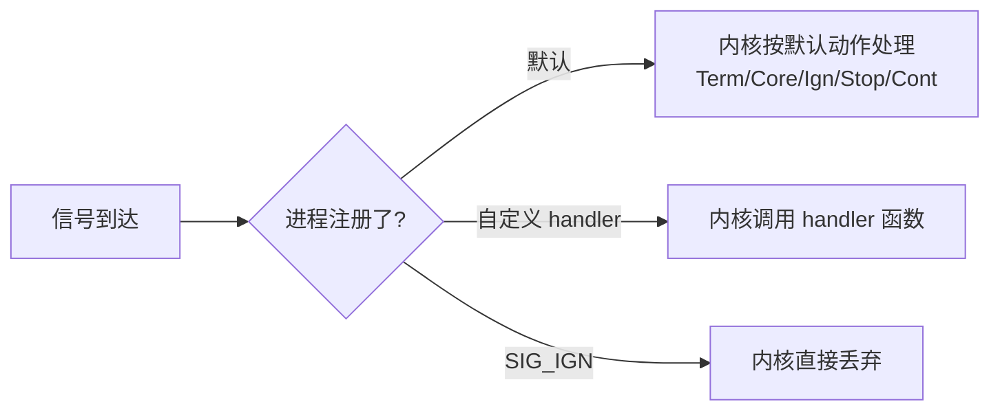
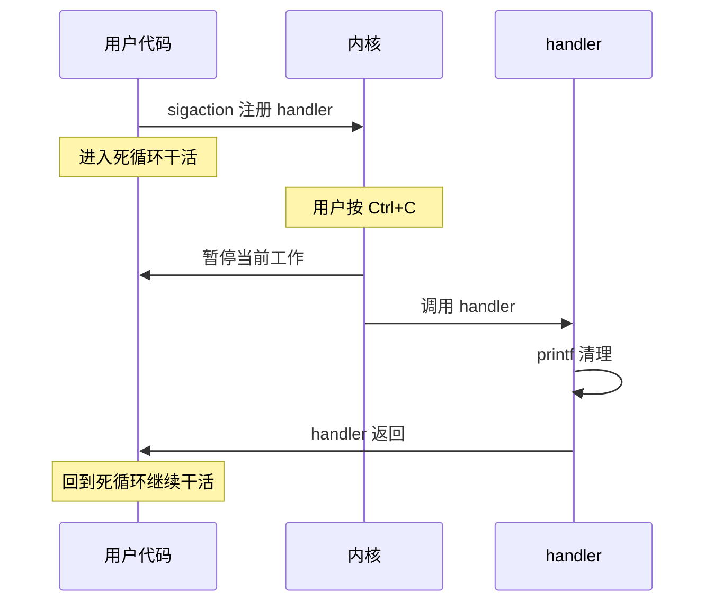
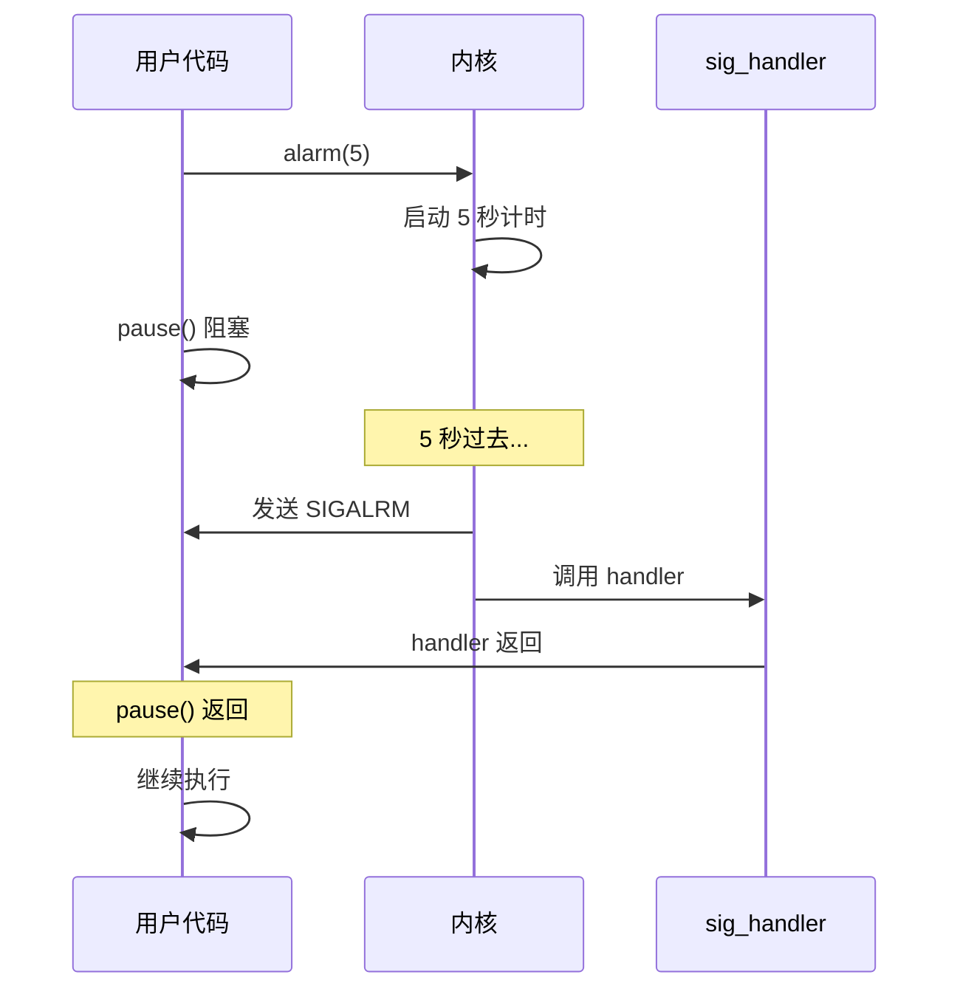

# 应用书 第 8 章 信号 学习笔记

> 何天诚 · 嵌入式 Linux 学习
> 创建时间:2026-06-08
> 对应教材:《I.MX6U 嵌入式 Linux C 应用编程指南 V1.6》第 8 章

- [应用书 第 8 章 信号 学习笔记](#应用书-第-8-章-信号-学习笔记)
  - [学习进度](#学习进度)
  - [8.1 信号是什么](#81-信号是什么)
    - [进程对信号的 3 种处理方式](#进程对信号的-3-种处理方式)
    - [默认动作 5 种](#默认动作-5-种)
    - [不可改写的两个信号](#不可改写的两个信号)
  - [8.2 信号分类(可靠 vs 不可靠)](#82-信号分类可靠-vs-不可靠)
    - [类比记忆](#类比记忆)
    - [对照表](#对照表)
    - [32/33 哪去了](#3233-哪去了)
    - [不可靠的 3 个历史包袱](#不可靠的-3-个历史包袱)
    - [经典坑:SIGCHLD 丢失](#经典坑sigchld-丢失)
  - [8.3 必背的 14 个信号](#83-必背的-14-个信号)
    - [1. 终止/退出类](#1-终止退出类)
    - [2. 程序崩溃类](#2-程序崩溃类)
    - [3. 进程控制类](#3-进程控制类)
    - [4. 定时/自定义](#4-定时自定义)
    - [SIGPIPE 工程坑](#sigpipe-工程坑)
  - [8.4 信号处理(本章核心)⭐⭐⭐](#84-信号处理本章核心)
    - [signal() vs sigaction() 选哪个](#signal-vs-sigaction-选哪个)
    - [sigaction 万能模板(背!)](#sigaction-万能模板背)
    - [struct sigaction 字段](#struct-sigaction-字段)
    - [sa\_flags 唯一要记的: SA\_RESTART](#sa_flags-唯一要记的-sa_restart)
    - [信号处理工作流](#信号处理工作流)
    - [实战:三种死法对比](#实战三种死法对比)
    - [shell 杀死打印对照](#shell-杀死打印对照)
  - [8.5 信号发送(简单)](#85-信号发送简单)
    - [kill() 的 pid 参数 4 种特殊值](#kill-的-pid-参数-4-种特殊值)
    - [sig=0 的妙用(面试)](#sig0-的妙用面试)
  - [8.6 alarm + pause(定时机制)](#86-alarm--pause定时机制)
    - [alarm() — 非阻塞计时器](#alarm--非阻塞计时器)
    - [pause() — 阻塞等任意信号](#pause--阻塞等任意信号)
    - [组合用法 1: 定时退出](#组合用法-1-定时退出)
    - [组合用法 2: 自己实现 sleep](#组合用法-2-自己实现-sleep)
    - [时序图](#时序图)
    - [实战应用](#实战应用)
    - [⚠ alarm 不精确](#-alarm-不精确)
  - [关键代码模板](#关键代码模板)
    - [模板 1: 捕获 Ctrl+C 优雅退出](#模板-1-捕获-ctrlc-优雅退出)
    - [模板 2: 服务器忽略 SIGPIPE](#模板-2-服务器忽略-sigpipe)
    - [模板 3: alarm 超时保护](#模板-3-alarm-超时保护)
    - [模板 4: 探活检测](#模板-4-探活检测)
  - [面试速查](#面试速查)
  - [踩坑](#踩坑)
    - [1. signal 第一次注册后 handler 自动复位(老 UNIX 行为)](#1-signal-第一次注册后-handler-自动复位老-unix-行为)
    - [2. handler 里不能用大部分函数](#2-handler-里不能用大部分函数)
    - [3. handler 跨平台行为不一致用 signal()](#3-handler-跨平台行为不一致用-signal)
    - [4. alarm 被信号打断会重新计时](#4-alarm-被信号打断会重新计时)
    - [5. 多次 alarm 覆盖](#5-多次-alarm-覆盖)
    - [6. SIGCHLD 默认 ignore 但子进程仍变僵尸](#6-sigchld-默认-ignore-但子进程仍变僵尸)
  - [一句话总结](#一句话总结)
  - [下一步](#下一步)

## 学习进度

- [x] 8.1 信号的概念
- [x] 8.2 信号的分类(可靠/不可靠)
- [x] 8.3 常见信号(20+ 个,核心 14 个)
- [x] 8.4 信号处理(signal / sigaction)⭐⭐⭐
- [x] 8.5 信号发送(kill / raise)
- [x] 8.6 alarm + pause(定时)
- [ ] 8.7 信号集
- [ ] 8.8 信号屏蔽
- [ ] 8.9-8.12 sigsuspend / 实时信号 / abort

> **本章定位**:**秋招面试硬核章节**。signal handler + sigaction + alarm + 信号集组合起来,是面试官最爱问的"异步编程"基础。**驱动开发里用户态用 SIGIO 异步通知驱动事件,也是这一套**。

---

## 8.1 信号是什么

信号 = **进程间异步通信机制**,类比"敲门"或"广播"。

特点:
- **异步** —— 你不知道啥时候来,但来了就要处理
- **有限种类** —— 1~31 是标准信号,34~64 是实时信号
- **不能传太多数据** —— 只能传"信号编号"(实时信号可以附带 1 个 int 或指针)

来源:
- **用户操作** —— Ctrl+C(SIGINT)、Ctrl+\(SIGQUIT)、Ctrl+Z(SIGTSTP)
- **kill 命令** —— `kill -9 PID`、`kill PID`
- **内核检测异常** —— 段错误(SIGSEGV)、除零(SIGFPE)
- **定时器** —— alarm 到时(SIGALRM)
- **其他进程** —— 用 kill() 发送

### 进程对信号的 3 种处理方式



### 默认动作 5 种

| 缩写 | 含义 |
|------|------|
| **term** | 终止进程 |
| **term+core** | 终止 + 生成 core dump(可 gdb 调试) |
| **ignore** | 内核丢弃,啥都不做 |
| **stop** | 暂停进程(可恢复) |
| **cont** | 让暂停的进程继续 |

### 不可改写的两个信号

- **SIGKILL (9)** —— 强杀,不能捕获、不能忽略、不能阻塞
- **SIGSTOP (19)** —— 强暂停,同上

这是内核留的"杀手锏",保证流氓程序永远能被干掉。

---

## 8.2 信号分类(可靠 vs 不可靠)

### 类比记忆

- **不可靠信号** = 门铃 🔔 (多次按只响 1 次,会丢)
- **可靠信号** = 语音留言 📬 (每条都排队,1 条不丢)

### 对照表

| 维度 | 不可靠信号(1-31) | 可靠信号(34-64) |
|------|----------------|-----------------|
| 名字 | 标准信号 / UNIX 信号 | 实时信号 / POSIX 信号 |
| **排队** | ❌ 多次合并成 1 次 | ✅ 全部排队 |
| **数据** | ❌ 只能传信号号 | ✅ 可附 int 或指针 |
| **顺序** | ❌ 不保证 | ✅ 保证 |
| **发送 API** | `kill(pid, sig)` | `sigqueue(pid, sig, value)` |
| **内核存储** | 一个 32 位 bitmap(1 个 bit/信号) | 队列链表 |
| 编号 | 1~31 | SIGRTMIN~SIGRTMAX(34~64) |

### 32/33 哪去了

被 glibc 内部用了(NPTL 线程库实现),用户可用 31 个实时信号(34~64)。

### 不可靠的 3 个历史包袱

1. handler 跑完**自动恢复默认动作** → 必须每次重新注册(sigaction 修复)
2. **不排队** → 多次信号合并丢失(实时信号修复)
3. handler 中**信号未屏蔽** → 可能被同信号嵌套打断(sigaction 修复)

### 经典坑:SIGCHLD 丢失

父进程同时启动 10 个子进程,几乎同时结束 → 10 个 SIGCHLD 到达 → **被合并成 1~2 个** → 父进程只回收 1~2 个 → **8~9 个僵尸进程残留**。

**修复**: handler 里循环 `waitpid(-1, &status, WNOHANG)` 直到返回 0,**不能假设"信号数 = 子进程数"**。(8.7+ 节细讲)

---

## 8.3 必背的 14 个信号

按用途分 4 组背:

### 1. 终止/退出类

| 信号 | 编号 | 触发 | 默认 |
|------|------|------|------|
| **SIGINT** | 2 | Ctrl+C | term |
| **SIGQUIT** | 3 | Ctrl+\ | term+core |
| **SIGKILL** | 9 | `kill -9` | term **(不可捕获)** |
| **SIGTERM** | 15 | `kill` 默认 | term |

### 2. 程序崩溃类

| 信号 | 编号 | 触发 | 默认 |
|------|------|------|------|
| **SIGSEGV** | 11 | 段错误(空指针/越界) | term+core |
| **SIGABRT** | 6 | abort() 调用 | term+core |
| **SIGPIPE** | 13 | 写已关闭的管道/socket | **term(坑!)** |

### 3. 进程控制类

| 信号 | 编号 | 触发 | 默认 |
|------|------|------|------|
| **SIGSTOP** | 19 | 强制暂停 | stop **(不可捕获)** |
| **SIGCONT** | 18 | 让暂停的继续 | cont |
| **SIGTSTP** | 20 | Ctrl+Z | stop |
| **SIGCHLD** | 17 | 子进程结束 | **ignore** |

### 4. 定时/自定义

| 信号 | 编号 | 触发 |
|------|------|------|
| **SIGALRM** | 14 | alarm 定时到 |
| **SIGUSR1** | 10 | 用户自定义 1 |
| **SIGUSR2** | 12 | 用户自定义 2 |

### SIGPIPE 工程坑

写一个对面关掉的 socket → 收到 SIGPIPE → **默认终止你的服务器进程**!

**修复**: 服务器启动时一句话:
```c
signal(SIGPIPE, SIG_IGN);   // 忽略 SIGPIPE,让 write 返回 -1 + EPIPE
```

---

## 8.4 信号处理(本章核心)⭐⭐⭐

### signal() vs sigaction() 选哪个

- `signal()` 是历史包袱,不同 UNIX 系统行为不一致
- **`sigaction()` 是 POSIX 标准**,跨平台一致,**现代代码全用这个**

### sigaction 万能模板(背!)

```c
#include <signal.h>
#include <stdio.h>
#include <unistd.h>

void my_handler(int sig)
{
    printf("收到信号 %d\n", sig);
    // 这里做清理 / 退出 / 重新加载配置等
}

int main(void)
{
    struct sigaction sa;
    sa.sa_handler = my_handler;       // 我的回调
    sigemptyset(&sa.sa_mask);          // 清空屏蔽集(handler 中不额外屏蔽)
    sa.sa_flags = 0;                   // 默认行为
    
    sigaction(SIGINT, &sa, NULL);      // 给 SIGINT 注册
    
    while (1) {
        printf("running...\n");
        sleep(1);
    }
    return 0;
}
```

### struct sigaction 字段

```c
struct sigaction {
    void (*sa_handler)(int);                    // ⭐ 你的回调
    void (*sa_sigaction)(int, siginfo_t*, void*);// 高级版回调(初学跳过)
    sigset_t sa_mask;                            // handler 中屏蔽哪些信号
    int      sa_flags;                           // 行为开关
    void (*sa_restorer)(void);                   // 别管,内部用
};
```

**初学 99% 只用 2 个字段**:`sa_handler` 和 `sa_flags`。

### sa_flags 唯一要记的: SA_RESTART

如果不设 SA_RESTART:
```c
read(fd, buf, 100);   // 阻塞等数据
// 此时来一个信号,handler 跑完后,read 返回 -1, errno=EINTR
// 你要自己判 errno 重试,烦
```

设了 SA_RESTART:
```c
sa.sa_flags = SA_RESTART;
// 信号打断后内核自动重启 read,你感受不到
```

**工程代码几乎所有 handler 都加 SA_RESTART**。

### 信号处理工作流



### 实战:三种死法对比

测试代码(ch08/01_catch_sigint.c)注册了 SIGINT handler。三种命令杀它:

| 命令 | 信号 | 结果 |
|------|------|------|
| Ctrl+C 或 `kill -2 PID` | SIGINT (2) | **被 handler 拦下,不死**,打印"收到信号 2" |
| `kill PID` | SIGTERM (15) | **直接死**(没注册 SIGTERM handler,用默认 term) |
| `kill -9 PID` | SIGKILL (9) | **瞬间死**,shell 打印 `Killed` |

### shell 杀死打印对照

| 信号杀死 | shell 显示 |
|---------|-----------|
| SIGKILL | `Killed` |
| SIGSEGV | `Segmentation fault (core dumped)` |
| SIGABRT | `Aborted` |
| SIGBUS | `Bus error` |
| SIGFPE | `Floating point exception` |

---

## 8.5 信号发送(简单)

3 个函数,全是命令行 `kill` 的 C 版本:

```c
kill(pid, sig);        // 发信号给某个 PID
raise(sig);            // 发给自己,等价 kill(getpid(), sig)
killpg(pgrp, sig);     // 发给整个进程组
```

### kill() 的 pid 参数 4 种特殊值

| pid | 行为 |
|-----|------|
| 正数 | 发给这个 PID |
| **0** | 发给和自己同进程组的所有进程 |
| **-1** | 发给所有进程(除了 init) |
| 负数 | 发给进程组 ID = `-pid` 的所有进程 |

### sig=0 的妙用(面试)

```c
if (kill(pid, 0) == 0) {
    // 进程存在
} else if (errno == ESRCH) {
    // 进程不存在
}
```

**用途**: 探测某个 PID 是否还活着,**不实际发信号**。

---

## 8.6 alarm + pause(定时机制)

### alarm() — 非阻塞计时器

```c
unsigned int alarm(unsigned int seconds);
```

- 告诉内核 `seconds` 秒后发 SIGALRM 给我
- **立刻返回**,不阻塞
- `alarm(0)` 取消之前设的闹钟,返回剩余秒数
- 同一进程只能有 1 个 alarm,新 alarm 覆盖旧的

### pause() — 阻塞等任意信号

```c
int pause(void);
```

- **阻塞**直到收到任意信号
- 收到信号 → handler 跑完 → pause 返回 -1, errno=EINTR

### 组合用法 1: 定时退出

```c
void on_alarm(int sig) {
    puts("Timeout");
    exit(0);                    // ← handler 里 exit,程序自动结束
}

sigaction(SIGALRM, &sa, NULL);
alarm(5);
for (;;) do_work();             // 死循环干活
// 5 秒后 SIGALRM → handler → exit
```

### 组合用法 2: 自己实现 sleep

```c
void noop(int sig) {}           // 啥也不干的 handler

void my_sleep(unsigned int s) {
    struct sigaction sa = {0};
    sa.sa_handler = noop;
    sigaction(SIGALRM, &sa, NULL);
    alarm(s);
    pause();                    // 阻塞等 SIGALRM
}
```

**这就是 sleep() 的内部实现思路**。

### 时序图


### 实战应用

| 场景 | 用法 |
|------|------|
| 防止程序卡死 | alarm(30) 保护 + 任务完成后 alarm(0) 取消 |
| 限时输入 | alarm(10) + fgets,超时自动退出 |
| 软看门狗 | handler 里检测 + 重设 alarm |

### ⚠ alarm 不精确

alarm() 精度是**秒**,且收到信号会被打断重新计时。
**精确定时**用 `setitimer()` / `timer_create()` / `timerfd_create()`(8.x 节有讲)。

---

## 关键代码模板

### 模板 1: 捕获 Ctrl+C 优雅退出

```c
volatile int running = 1;

void on_sigint(int sig) {
    running = 0;     // 设标志位,不在 handler 里做复杂事
}

int main(void) {
    struct sigaction sa = {0};
    sa.sa_handler = on_sigint;
    sa.sa_flags = SA_RESTART;
    sigaction(SIGINT, &sa, NULL);
    
    while (running) {
        do_work();
    }
    cleanup();
    return 0;
}
```

### 模板 2: 服务器忽略 SIGPIPE

```c
signal(SIGPIPE, SIG_IGN);   // 防止写死管道时被默认终止
```

### 模板 3: alarm 超时保护

```c
alarm(30);                  // 30 秒超时保护
heavy_work();               // 可能卡死的任务
alarm(0);                   // 任务完成,取消闹钟
```

### 模板 4: 探活检测

```c
if (kill(pid, 0) == 0)
    puts("alive");
else if (errno == ESRCH)
    puts("dead");
```

---

## 面试速查

- [ ] SIGINT / SIGTERM / SIGKILL 各自触发方式和能否捕获
- [ ] signal() 和 sigaction() 为什么推荐后者(行为一致 + 功能强)
- [ ] handler 函数有哪些限制(异步信号安全)
- [ ] 可靠信号 vs 不可靠信号区别(排队 / 数据 / 顺序)
- [ ] SIGCHLD 丢失原因和解决(waitpid 循环回收)
- [ ] SIGPIPE 默认行为和服务器为啥忽略
- [ ] alarm + pause 怎么实现 sleep
- [ ] kill(pid, 0) 干嘛用(探活)
- [ ] sa_flags 的 SA_RESTART 作用(信号打断 syscall 自动重启)

---

## 踩坑

### 1. signal 第一次注册后 handler 自动复位(老 UNIX 行为)

Linux 已修复,但 sigaction 永远稳。**新代码用 sigaction**。

### 2. handler 里不能用大部分函数

handler 是异步调用,大部分函数不是"异步信号安全"(async-signal-safe)。
**handler 里能用的函数列表**: man 7 signal-safety,主要是 write/_exit/getpid 等。
**printf 严格说不安全**(内部有锁),但 demo 用没事;生产代码 handler 只设标志位,主循环处理。

### 3. handler 跨平台行为不一致用 signal()

老 BSD: handler 跑完保持注册
老 System V: handler 跑完恢复默认
→ **用 sigaction 一了百了**

### 4. alarm 被信号打断会重新计时

alarm 中途被另一个信号打断,handler 跑完,**alarm 的剩余时间会重新算**。要精确定时用 setitimer/timerfd。

### 5. 多次 alarm 覆盖

```c
alarm(10);
alarm(5);    // ← 前面那个被取消,只剩这次的 5 秒
```

### 6. SIGCHLD 默认 ignore 但子进程仍变僵尸

```c
signal(SIGCHLD, SIG_IGN);   // 内核会自动回收子进程,但...
```
不同写法效果不同,**推荐 wait/waitpid 显式回收**。

---

## 一句话总结

> **信号 = 异步打断的"敲门"机制。**
>
> **sigaction 注册 handler,kill 发送,alarm 定时,handler 里只设标志位。**
>
> **SIGKILL 和 SIGSTOP 是内核杀手锏,改不了。**

---

## 下一步

- [ ] 8.7 信号集 sigset_t(阻塞特定信号)
- [ ] 8.8 信号屏蔽 sigprocmask
- [ ] 8.9 sigsuspend
- [ ] 8.10 实时信号 sigqueue
- [ ] 8.11 setitimer 精确定时器
- [ ] 8.12 abort()
- 