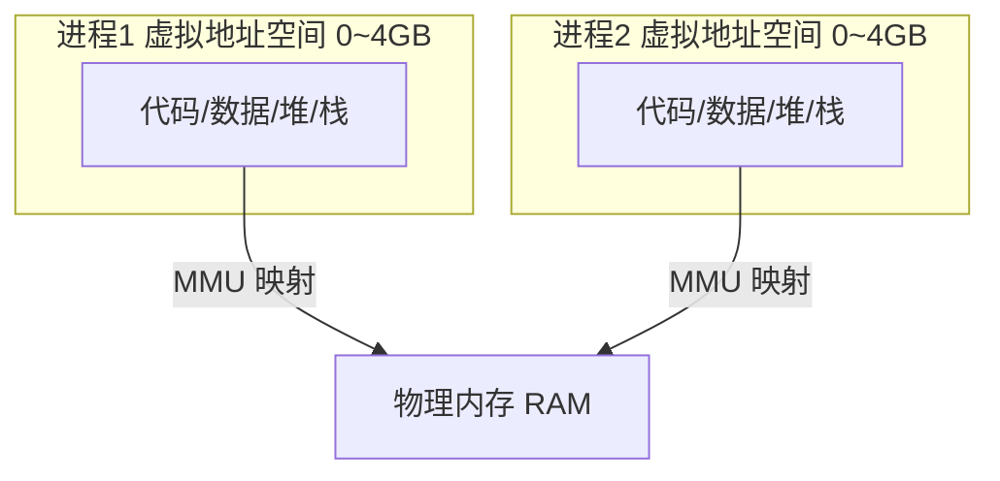
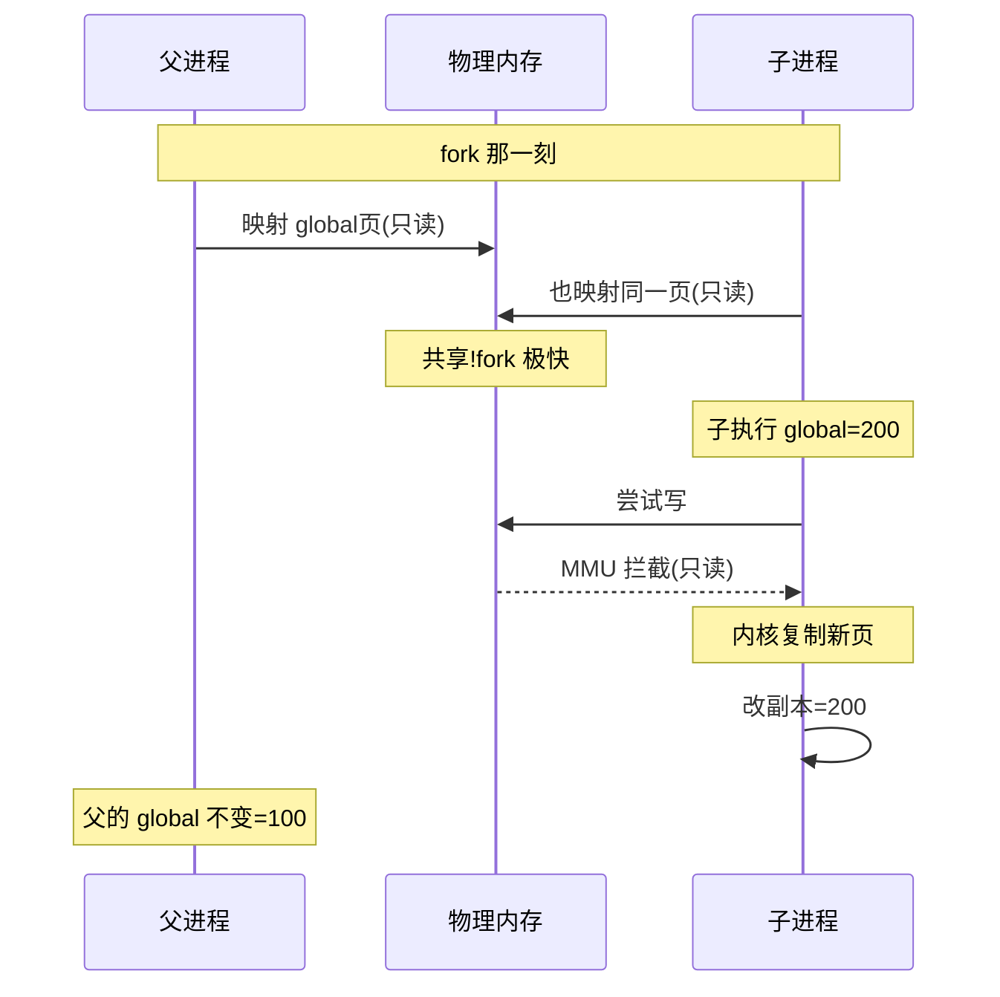
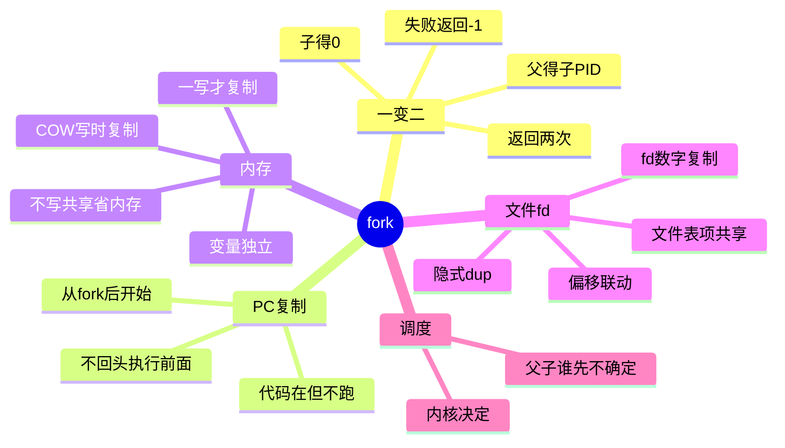

# 应用书 第 9 章 进程 学习笔记

> 何天诚 · 嵌入式 Linux 学习
> 创建时间:2026-06-09
> 对应教材:《I.MX6U 嵌入式 Linux C 应用编程指南 V1.6》第 9 章

## 学习进度

- [x] 9.1 进程基础(main / 退出 / atexit / PID)
- [x] 9.2 进程环境变量
- [x] 9.3 C 程序内存布局 ⭐⭐⭐⭐⭐
- [x] 9.4 进程虚拟地址空间 ⭐⭐⭐⭐⭐
- [ ] 9.5 fork() 创建进程 ⭐⭐⭐⭐⭐
- [ ] 9.6-9.14 exec / wait / 僵尸 / 守护进程

> **本章定位**:**秋招面试最硬核章节之一**。内存布局 + 虚拟地址 + fork/exec/wait 是嵌入式 / 后端 / 操作系统岗的必考题。

---

## 9.1 进程基础

### 程序退出的 5 种方式

| 方式 | 刷缓冲 | 调 atexit | 备注 |
|------|-------|----------|------|
| main 中 `return n` | ✅ | ✅ | 等价 exit(n) |
| `exit(n)` | ✅ | ✅ | C 库函数,标准退出 |
| `_exit(n)` / `_Exit(n)` | ❌ | ❌ | syscall,直接退出 |
| `abort()` | ✅ | ❌ | 发 SIGABRT,必死,生成 core |
| 致命信号 | - | - | SIGKILL/SIGTERM 等默认 term |

### atexit 退出钩子

```c
#include <stdlib.h>
int atexit(void (*function)(void));
```

- 注册的函数在 `exit()` 时**反序调用(LIFO)**
- `_exit` 和 `abort` **不触发** atexit
- 典型用途:关文件 / 释放共享内存 / 写最后日志

```c
void bye(void) { puts("Goodbye!"); }
int main(void) {
    atexit(bye);     // 退出时自动调
    exit(0);
}
```

注册多个时,后注册的先执行:
```c
atexit(a); atexit(b); atexit(c);
// 退出时执行顺序: c → b → a
```

### PID 进程身份

```c
#include <unistd.h>
pid_t getpid(void);      // 自己的 PID
pid_t getppid(void);     // 父进程 PID
```

- PID 全系统唯一(同一时间)
- 所有进程的祖先 = init (PID 1)
- 进程结束后 PID 可复用,是"当前快照"不是永久身份

---

## 9.2 进程环境变量(了解即可)

进程启动时从父进程**继承**一份环境变量(`NAME=value` 字符串数组)。

```c
#include <stdlib.h>

extern char **environ;                      // 全局,指向变量数组
char *getenv(const char *name);             // 读(最常用)
int   putenv(char *string);                 // "NAME=value" 一体设
int   setenv(name, value, overwrite);       // 分开设,可控覆盖
int   unsetenv(name);                       // 删
int   clearenv(void);                       // 清空
```

最常用:
```c
char *home = getenv("HOME");    // /home/book
char *path = getenv("PATH");    // 命令搜索路径
```

**嵌入式驱动方向重要度低**,记住 `getenv` 即可,其他用到查 man。
交叉编译时常见 `ARCH=arm CROSS_COMPILE=...` 就是环境变量。

---

## 9.3 C 程序内存布局 ⭐⭐⭐⭐⭐(面试必考)

### 五段布局图

```
高地址  ┌──────────────────┐
        │   命令行参数+环境  │  argv / environ
        ├──────────────────┤
        │   栈 stack        │  局部变量/函数返回地址/寄存器状态
        │      ↓ 向下增长    │
        │                  │
        │   (未分配区域)    │
        │                  │
        │      ↑ 向上增长    │
        │   堆 heap         │  malloc/calloc 动态分配
        ├──────────────────┤
        │   bss 段          │  未初始化 / 零初始化的全局、static
        ├──────────────────┤
        │   data 段         │  已初始化(非0)的全局、static
        ├──────────────────┤
        │  .rodata 只读段    │  字符串常量 / const 全局
        ├──────────────────┤
        │   text 代码段      │  机器指令(只读)
低地址  └──────────────────┘
```

### 五段详解

| 段 | 存什么 | 特点 |
|----|--------|------|
| **text 代码段** | 编译后的机器指令 | 只读(防篡改),可共享 |
| **.rodata 只读数据** | 字符串常量、const 全局 | 只读,写它 → 段错误 |
| **data 数据段** | 已初始化非0的全局/static | 可读写,初值存在文件里 |
| **bss 段** | 未初始化/初始化为0的全局/static | 可读写,文件不存内容,加载时清零 |
| **heap 堆** | malloc/calloc | 手动管理,低→高增长 |
| **stack 栈** | 局部变量/返回地址/寄存器 | 自动管理,高→低增长 |

### 变量在哪段?(背)

```c
int a = 5;              // data(初始化非0)
int b;                 // bss(未初始化)
int c = 0;             // bss(初始化为0也算bss)

void func() {
    int x = 10;        // stack(局部变量)
    static int y = 20; // data(static + 非0初值)
    static int z;      // bss(static + 未初始化)
    char *p = "hi";    // p在stack,"hi"在.rodata
    char arr[] = "hi"; // arr在stack(整个字符串拷到栈)
    int *q = malloc(8);// q在stack,malloc的8字节在heap
}
```

### ⭐ 易错点 1:字符串常量段错误(高频)

```c
char *p = "hello";
p[0] = 'H';            // ❌ 段错误!
```

**原因**:
- `p`(指针)在栈
- `"hello"`(常量)在 **.rodata 只读段**
- 写只读页 → MMU 拦截 → SIGSEGV

**对比能改的**:
```c
char arr[] = "hello";  // "hello" 被复制到栈上
arr[0] = 'H';          // ✅ 改的是栈上副本
```

**建议**:字符串常量用 `const char *p = "hello"`,编译期就拦写操作。

### ⭐ 易错点 2:为什么 bss 和 data 分开(高频)

**核心:省可执行文件体积**。

```c
int arr[1000000];      // 4MB 全局数组
```

| | data | bss |
|---|------|-----|
| 变量 | 有初值 | 无初值/零初值 |
| 文件里 | **完整存初值** → 占体积 | **只记大小,不存内容** |
| 加载时 | 从文件读 | 内核分配 + 清零 |

**所以** `int arr[1000000]` 放 bss,**.elf 文件不会大 4MB**,文件里只写"我需要 4MB 清零空间"。

**验证实验**:
```c
// t1: int big[1000000];        → bss,文件小
// t2: int big[1000000]={1,2,..} → data,文件大4MB
```
```bash
gcc t1.c -o t1 && ls -l t1   # 小
gcc t2.c -o t2 && ls -l t2   # 大 4MB
```

### 查看程序的段大小

```bash
size ./a.out
#   text    data     bss     dec     hex filename
#   1234     520       8    1762     6e2 a.out
```
- text: 代码大小
- data: 初始化数据大小
- bss: 未初始化数据大小(不占文件,占运行内存)

---

## 9.4 进程虚拟地址空间 ⭐⭐⭐⭐⭐(面试必考)

### 核心概念:每个进程都以为自己独占整个内存



- 32 位系统:每个进程有 **4GB 虚拟地址空间**
- Linux 经典划分 **3:1** → 用户空间 3GB(0~0xBFFFFFFF) + 内核空间 1GB(0xC0000000~)
- **虚拟地址 ≠ 物理地址**,中间隔着 MMU

### MMU 干什么

**MMU(Memory Management Unit)= 地址翻译官**

```
程序用的地址(虚拟)  →  MMU + 页表  →  实际内存地址(物理)
0x80800000                              0x12345000(随便哪)
```

- 程序只看到虚拟地址,**不知道真实物理位置**
- MMU 用**页表**把虚拟页映射到物理页
- 翻译有缓存加速:**TLB**(Translation Lookaside Buffer)

### 虚拟内存的 4 大好处(面试)

1. **隔离**:进程A改不了进程B的内存(各自独立地址空间)
2. **每个进程地址一致**:都从 0 开始,编译器不用关心实际加载位置
3. **内存超分**:物理 1GB 也能跑用 2GB 的程序(用 swap / 惰性分配)
4. **权限控制**:代码段只读、数据段可写,MMU 按页设权限

### 几个地址概念区分(你八股已有,这里对齐)

| 概念 | 含义 |
|------|------|
| 逻辑地址 | 程序里写的地址(段:偏移,x86历史) |
| 线性地址 / 虚拟地址 | 经过分段后的地址,MMU 输入 |
| 物理地址 | MMU 输出,真实 RAM 地址 |

Linux 下分段基本废弃(段基址设0),**逻辑地址 ≈ 虚拟地址**。

### 惰性分配 + 缺页中断(经典面试题)

**Q: malloc 1.2GB 在 1GB 物理内存的机器上能成功吗?**

**A: 能!** 因为:
1. malloc 只分配**虚拟地址**,不立刻给物理内存(**惰性分配**)
2. 你**真正访问**某页时,MMU 发现没映射 → 触发**缺页中断**
3. 内核这时才分配物理页
4. 物理不够 → 用 **swap**(换到磁盘)
5. 实在不够 → **OOM Killer** 杀进程

**所以**:malloc 成功 ≠ 物理内存到手,**用到才给**。

### 嵌入式相关

- IMX6ULL 这种带 MMU 的 Cortex-A 跑 Linux,有完整虚拟地址
- STM32 这种 Cortex-M **没 MMU**,地址就是物理地址(所以裸机/RTOS 没"虚拟内存")
- **这是 MCU 和 Linux 嵌入式的核心区别之一**,面试可能问

---

## 关键代码模板

### 模板 1: atexit 清理钩子

```c
void cleanup(void) { /* 关文件/释放资源 */ }
int main(void) {
    atexit(cleanup);
    /* ... */
    return 0;   // 自动触发 cleanup
}
```

### 模板 2: 读环境变量

```c
char *val = getenv("MYVAR");
if (val) printf("%s\n", val);
```

### 模板 3: 验证字符串常量只读

```c
char *p = "hello";
// p[0] = 'H';        // 会段错误
char arr[] = "hello";
arr[0] = 'H';         // OK
```

---

## 面试速查

- [ ] C 程序内存五段,各存什么
- [ ] `int a=5` / `int b` / `int c=0` 各在哪段
- [ ] static 局部变量在哪段,为什么
- [ ] `char *p="x"` 为什么 p[0]='X' 段错误
- [ ] bss 和 data 为什么分两段(省文件体积)
- [ ] 堆和栈 3 个区别(管理/方向/速度)
- [ ] 栈为什么比堆快
- [ ] 虚拟地址空间 3:1 划分
- [ ] MMU 干什么,TLB 是什么
- [ ] malloc 1.2G 在 1G 内存能否成功(惰性分配)
- [ ] STM32 和 Linux 嵌入式内存模型区别(有无 MMU)

---

## 踩坑

### 1. char *p="x" 写常量段错误
字符串常量在 .rodata 只读段,改它 SIGSEGV。要改用 `char arr[]="x"`。

### 2. 局部变量返回地址(悬空指针)
```c
char *bad(void) {
    char buf[10] = "hi";
    return buf;          // ❌ 返回栈地址,函数结束栈帧销毁
}
```
修复:malloc 堆内存,或传入缓冲区。

### 3. static 局部变量只初始化一次
```c
void f(void) {
    static int n = 0;    // 只在第一次调用时初始化
    n++;                  // 跨调用累加
}
```

### 4. bss 变量保证为0,栈变量不保证
```c
int g;                   // 全局,bss,保证是0
void f() {
    int x;               // 局部,栈,垃圾值!
}
```

---
## 9.5 fork() 创建进程 ⭐⭐⭐⭐⭐(面试核心)

### 函数原型

```c
#include <unistd.h>
pid_t fork(void);
```

**一次调用,返回两次**:

| 返回值 | 在哪个进程 | 含义 |
|--------|----------|------|
| 子进程的 PID(正数) | **父进程** | 父拿到孩子的身份证号 |
| **0** | **子进程** | 子进程的标志 |
| **-1** | 父进程 | fork 失败(资源不足) |

### 标准用法

```c
pid_t pid = fork();
switch (pid) {
case -1:
    perror("fork");
    exit(-1);
case 0:
    /* 子进程走这 */
    _exit(0);          // 子进程用 _exit
default:
    /* 父进程走这,pid = 子PID */
    exit(0);           // 父进程用 exit
}
```

或者用 if:
```c
pid_t pid = fork();
if (pid == 0) {
    /* 子进程 */
} else if (pid > 0) {
    /* 父进程 */
} else {
    /* fork 失败 */
}
```

### ⭐ 核心困惑 1:fork 后代码怎么执行?

**fork 是"分裂点",不是普通函数调用。**

```c
printf("A\n");       // fork 前:只有 1 个进程,打印 1 次
fork();              // ← 分裂!之后变成 2 个进程
printf("B\n");       // fork 后:父子都跑,打印 2 次
```

输出:
```
A          ← 1 次
B          ← 父打印
B          ← 子打印
```

**关键认知**: 从裸机的"一条执行线"变成"两条执行线"。fork 之后的每一行,父子各跑一遍。

### ⭐ 核心困惑 2:为什么子进程不执行 fork 之前的代码?

**因为 fork 复制了父进程的 PC 指针(程序计数器)。**

裸机里 CPU 靠 PC 寄存器决定"下一条执行哪",fork 复制子进程时,**连"执行到 fork 这一行"的状态也复制了**:

```
父进程执行到 fork 时:PC 指向 → fork 的下一条
fork 复制 → 子进程的 PC 也指向 → fork 的下一条
```

所以子进程一"出生"就从 fork 之后开始,**不会回头执行前面**。

**类比游戏存档**:存档记了"你打到第 5 关",读档不会从第 1 关重来。fork 的存档记了"执行到 fork 这行"。

**重要区分**:代码全复制了(在内存里),但 **CPU 只执行 PC 指向的位置往后**。fork 之前的代码"在那但没人跑"。

**实验验证**(ch09/01_fork_basic.c):
```
fork之前,pid是5010              ← 只 1 次!证明子进程没回头执行
fork 之后 (PID=5010, 返回=5011)  ← 父进程
fork 之后 (PID=5011, 返回=0)     ← 子进程
```

### ⭐ 核心困惑 3:fork 后变量是共享还是独立?

**独立!父子各有一份副本,改自己的不影响对方。**

**实验验证**(ch09/02_fork_var.c):
```c
int global = 100;
int main() {
    int local = 200;
    if (fork() == 0) {
        global = 200; local = 400;   // 子进程改
        // 输出: global=200, local=400
    } else {
        sleep(1);
        // 输出: global=100, local=200  ← 父进程的没变!
    }
}
```

子进程改了 global/local,**父进程的完全不受影响** → 各自独立内存。

**和多线程的区别**:
- fork(多进程):变量**独立**,改自己的不影响对方
- 多线程:变量**共享**,要加锁(11-12 章学)

### COW 写时复制(面试高频)

**问题**: fork 一个用了 2GB 内存的进程,要立刻复制 2GB 吗?
**答案**: 不! COW(Copy-On-Write,写时复制)优化。

```
fork 那一刻:
  父子映射到【同一份物理内存】,标记【只读】
  → fork 极快,只复制页表(几 KB),不复制数据

谁要写这块内存:
  MMU 发现"写只读页" → 缺页中断
  内核这时才【复制那一页】
  → 从此父子各有各的那页
```

**所以**:
- 不写 → 共享物理内存(省内存)
- 一写 → 才复制那一页(保证独立)
- 对程序员:看起来就是两份独立副本



**面试金句**:
> "fork 后父子共享内存吗?" → "逻辑独立,物理 COW 优化。fork 那刻映射同一物理页(只读),谁写谁触发缺页中断复制。fork 快、省内存,对程序员是两份独立副本。"

### ⭐ 核心困惑 4:父子谁先执行?

**不确定!由内核调度决定。**

```bash
./01_fork_basic   # 这次父先
./01_fork_basic   # 那次可能子先
```

多次运行,输出顺序可能变。这不是 bug,是多进程的本质。**要控制顺序得用同步手段**(wait / 信号 / 管道)。

### 子进程复制了什么?

| 复制(独立副本) | 共享 | 不复制 |
|----------------|------|--------|
| 数据段、bss、堆、栈(COW) | 代码段(只读) | - |
| 打开的文件描述符(数字) | **文件表项(偏移)** | - |
| 信号处理设置 | | |
| 环境变量 | | |
| 当前工作目录 | | |
| PID → **不一样**(子有新 PID) | | |

---

## 9.6 父子进程的文件共享 ⭐⭐⭐⭐

### fd 共享文件偏移(和变量相反!)

**变量独立,但 fd 共享偏移** —— 为什么不同?

回忆第 3 章四级结构:
```
PCB → fd 表 → 文件表项(含偏移) → inode
```

**fork 复制的是"fd 这个数字",但 fd 指向的"文件表项"没复制**:

```
父进程: fd=3 ──┐
               ├──→ 同一个文件表项(偏移共享) ──→ inode
子进程: fd=3 ──┘
```

| | 复制了什么 | 结果 |
|---|----------|------|
| 变量 | 物理内存页(COW) | 独立 |
| fd | 只复制 fd 数字,**文件表项共享** | 偏移联动 |

**fork 继承 fd = 隐式的 dup**(第 3 章 dup 也是共享文件表项)。

### 实验验证(ch09/03_fork_fd.c)

```c
int fd = open("test.txt", O_RDWR | O_CREAT | O_TRUNC, 0644);
if (fork() == 0) {
    write(fd, "1234", 4);
    // 子进程偏移 = 4
    _exit(0);
} else {
    sleep(1);
    write(fd, "AABB", 4);
    // 父进程偏移 = 8 !(不是4)
}
```

**结果**:
```
子进程写完,偏移 4
父进程写完,偏移 8       ← 共享偏移的铁证!
文件内容: 1234AABB       ← 接续写,不覆盖
```

父进程偏移是 **8**(子4 + 父4),不是 4 → **证明父子共享同一个文件偏移量**。

### 对比:多次 open vs fork/dup

| 方式 | 文件表项 | 偏移 |
|------|---------|------|
| 多次 open 同一文件 | 各自独立 | 独立(会互相覆盖) |
| dup / fork 继承 | 共享同一个 | 联动(接续写) |

### 实战意义:多进程写一个日志文件

```c
int log_fd = open("app.log", O_WRONLY | O_CREAT | O_APPEND, 0644);
for (int i = 0; i < 3; i++) {
    if (fork() == 0) {
        write(log_fd, "child log\n", 10);
        _exit(0);
    }
}
```

偏移共享 + O_APPEND → 多个子进程写日志**自动接续不覆盖**。这就是 nginx 多 worker 写一个日志文件的原理。

---

## fork 完整知识图



---

## fork 实战代码记录

| # | 文件 | 验证了什么 |
|---|------|----------|
| 01 | ch09/01_fork_basic.c | fork 一变二,返回值区分身份,PC 复制 |
| 02 | ch09/02_fork_var.c | 变量独立(COW) |
| 03 | ch09/03_fork_fd.c | 文件 fd 偏移共享 |

---

## fork 面试速查

- [ ] fork 返回几次,各是什么值
- [ ] fork 后代码从哪开始执行(PC 复制)
- [ ] 为什么子进程不执行 fork 之前的代码
- [ ] fork 后变量共享还是独立(独立)
- [ ] COW 是什么,fork 2GB 进程会立刻复制吗
- [ ] fork 后父子谁先跑(不确定,内核调度)
- [ ] fork 后文件 fd 偏移共享吗(共享!)
- [ ] 为什么变量独立但 fd 共享偏移(文件表项没复制)
- [ ] 子进程为什么用 _exit 父进程用 exit(避免重复刷缓冲)

---

## fork 踩坑

### 1. fork 后 printf 没 \n 可能重复输出

```c
printf("hi");        // 没 \n,留缓冲区
fork();              // 缓冲区被复制!
// 父子各刷一次 → "hi" 输出 2 次
```
修复:fork 前 fflush,或 printf 都加 \n。

### 2. 子进程用 _exit 不用 exit

```c
if (fork() == 0) {
    exit(0);         // ⚠ exit 会刷父子共享的 stdio 缓冲,可能重复输出
    _exit(0);        // ✓ 子进程用 _exit,不碰缓冲
}
```

### 3. fork 失败要处理

```c
pid_t pid = fork();
if (pid == -1) {     // 资源不足(进程数达上限等)
    perror("fork");
}
```

### 4. 别假设父子执行顺序

```c
if (fork() == 0) { printf("子\n"); }
else { printf("父\n"); }
// 输出顺序不固定!要顺序用 wait/信号同步
```

---

## fork 一句话总结

> **fork 一变二:返回两次(父得子PID,子得0),复制 PC 所以从 fork 后开始跑。**
>
> **变量独立(COW 优化:不写共享,一写复制),文件 fd 共享偏移(文件表项没复制 = 隐式 dup)。**
>
> **父子谁先跑不确定,子进程用 _exit。**

---
## 9.7 vfork(了解,已淘汰)

### vs fork 对照

| | fork | vfork |
|---|------|-------|
| 地址空间 | 各自独立(COW) | **共享同一个** |
| 子改变量 | 不影响父 | **直接改父的内存** |
| 执行顺序 | 不确定 | **子先,父阻塞等** |
| 子进程限制 | 随便干 | **只能 exec / _exit** |
| 现在用? | ✅ 用 | ❌ 淘汰 |

### vfork 的两个硬约束(重点)

1. **子进程必须立刻 exec 或 _exit**,不能 return、不能改变量后继续
   - 因为父子共享栈,子进程乱动会破坏父进程栈帧
2. **父进程被挂起,直到子进程 exec 或 _exit**
   - 保证子先跑,父阻塞等(和 fork 的"顺序不确定"不同)

### 为什么淘汰

vfork 当年为"fork 后立刻 exec"省复制开销:
- 老 fork 复制整个内存 → exec 又把这些内存全扔掉 → 白复制
- vfork 不复制(共享),反正马上 exec 会换掉 → 省开销

但 **fork 有了 COW(写时复制)**,复制开销几乎没了(写时才复制,exec 前没写多少)→ **vfork 失去意义**。

**结论:用 fork,别用 vfork。**

### 面试金句

> fork 父子独立地址空间(COW),vfork 父子共享。vfork 要求子进程必须立刻 exec/_exit,父进程阻塞等。vfork 当年为 fork+exec 省复制开销,但 COW 让 fork 也几乎不复制了,所以 vfork 基本淘汰。

---

## 9.8 控制父子进程执行顺序

### 问题:fork 后父子谁先跑不确定

```c
switch (fork()) {
case 0:  printf("子\n"); _exit(0);
default: printf("父\n"); exit(0);
}
// 输出顺序随机!由内核调度决定
```

### 解法:信号同步(sigsuspend + kill)

PDF 9.8.2 的做法:

```c
// 父进程先注册 SIGUSR1 handler + 准备空等待集
sigset_t wait_mask;
sigemptyset(&wait_mask);
struct sigaction sa = {0};
sa.sa_handler = sig_handler;
sigaction(SIGUSR1, &sa, NULL);

switch (fork()) {
case 0:   // 子进程先干活
    printf("子先干活\n");
    sleep(2);
    kill(getppid(), SIGUSR1);   // 干完通知父进程
    _exit(0);
default:  // 父进程等子进程
    sigsuspend(&wait_mask);      // 阻塞,等子进程的信号
    printf("父后干活\n");        // 收到信号才继续
    exit(0);
}
```

**机制**: 父用 sigsuspend 阻塞等待,子干完用 `kill(getppid(), SIGUSR1)` 通知父 → 保证子先父后。

### ⭐ sleep vs 信号(关键认知)

很多人想用 sleep 控制顺序:
```c
default:
    sleep(1);        // ⚠ 赌子进程 1 秒内跑完
    printf("父\n");
```

**为什么 sleep 不可靠**:

| | sleep | 信号(sigsuspend + kill) |
|---|------|------------------------|
| 原理 | 父睡固定时间,**赌**子跑完 | 父**真的等到**子的通知 |
| 可靠性 | ❌ 不可靠 | ✅ 可靠 |
| 子进程慢 | **翻车**(子要2秒,父睡1秒就醒,顺序错) | 永远等到 |
| 子进程快 | 浪费时间(子0.1秒完,父白睡1秒) | 立刻继续,不浪费 |
| 本质 | 时间假设 | 事件同步 |

**翻车原因**: 你无法预测子进程多久跑完。系统负载高 / 子任务重 → sleep 的时间假设失效 → 顺序错。

### 工程铁律

> **永远不要用 sleep 做"同步"。**
> sleep 只适合"我就是想停 N 秒"(轮询间隔),**不适合"等另一个进程/线程完成"**。

正确的同步手段:
- **进程间**: 信号、管道、wait、共享内存+信号量
- **线程间**: 互斥锁、条件变量、信号量(11-12 章)

**用 sleep 做同步是新手最常见的错误,面试看到直接扣分。**

### 实战:真正控制顺序用 wait

9.8 用信号控制顺序是**教学演示**。实战里父子顺序控制更常用 **wait()**(9.10):
```c
pid_t pid = fork();
if (pid == 0) {
    do_child();
    _exit(0);
} else {
    wait(NULL);      // 父阻塞,直到子进程结束
    do_parent();     // 子结束后才执行
}
```

比信号更直接,下一节(9.10)详细学。

### 细节:sigsuspend 返回值

```c
if (-1 != sigsuspend(&wait_mask))   // sigsuspend 永远返回 -1, errno=EINTR
    exit(-1);                        // 不是 -1 说明出错
```

回忆 8.10 节,sigsuspend 被信号中断后返回 -1,这是正常的。

---

## 9.9 进程退出 + 退出状态

### 退出方式(复习)

| 正常 | 异常 |
|------|------|
| main return / exit() / _exit() | abort() / 被信号杀 |

### 退出状态 termination status

```c
exit(status);     // status 低 8 位有效(0~255)
```
- **0 = 成功,非 0 = 失败**
- 父进程用 wait() 拿到(9.10)
- shell 里 `echo $?` 查看上个程序退出码

```bash
./prog
echo $?      # 0=成功
```

### ⭐ fork + 缓冲经典坑(高频)

**printf 带 \n → 输出 1 次**:
```c
printf("Hi\n");    // 行缓冲遇\n刷,fork前已清空
fork();            // 复制的是空缓冲
// → 只打印 1 次
```

**printf 不带 \n → 输出 2 次!**:
```c
printf("Hi");      // 没\n,留在 stdio 缓冲区
fork();            // 缓冲区被复制!父子各一份"Hi"
// 父exit刷一次 + 子exit刷一次 → 打印 2 次
```

### 为什么(串联知识)

```
stdout 行缓冲(第4章) + fork 复制缓冲区 + exit 刷缓冲
= printf 不带\n + fork + exit → 输出翻倍
```

### 3 种修复

```c
printf("Hi\n");           // 1. 带\n,fork前刷
// 或
printf("Hi"); fflush(stdout); fork();   // 2. fork前手动刷
// 或
if (fork()==0) _exit(0);  // 3. 子进程_exit不刷缓冲
```

### 面试金句

> fork 前 printf 不加 \n 输出两次:stdout 行缓冲,内容留缓冲区,fork 复制了缓冲区,父子各刷一次。修复:加\n / fork前fflush / 子进程用_exit。
## 下一步

- [ ] 9.9 进程退出 + 僵尸进程 / 孤儿进程 ⭐⭐⭐⭐⭐(面试高频)
- [ ] 9.10 wait / waitpid 回收子进程 ⭐⭐⭐
- [ ] 9.11 exec 家族(替换进程映像)⭐⭐⭐⭐
- [ ] 9.12+ 守护进程

## 一句话总结

> **五段:text 代码、rodata 常量、data 有初值全局、bss 零初值全局、heap 手动、stack 自动。**
>
> **bss 不占文件体积(只记大小,加载清零)。字符串常量在只读段,改它段错误。**
>
> **每个进程独占 4GB 虚拟空间,MMU 翻译成物理地址,malloc 惰性分配用到才给。**

---

