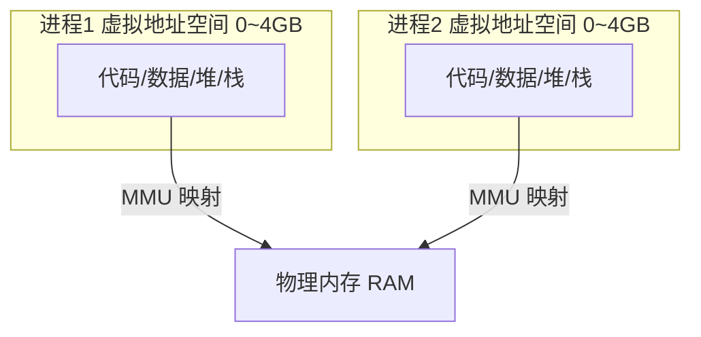

# 应用书 第 9 章 进程 学习笔记

> 何天诚 · 嵌入式 Linux 学习
> 创建时间:2026-06-09
> 对应教材:《I.MX6U 嵌入式 Linux C 应用编程指南 V1.6》第 9 章

## 学习进度

- [x] 9.1 进程基础(main / 退出 / atexit / PID)
- [x] 9.2 进程环境变量
- [x] 9.3 C 程序内存布局 ⭐⭐⭐⭐⭐
- [x] 9.4 进程虚拟地址空间 ⭐⭐⭐⭐⭐
- [ ] 9.5 fork() 创建进程 ⭐⭐⭐⭐⭐
- [ ] 9.6-9.14 exec / wait / 僵尸 / 守护进程

> **本章定位**:**秋招面试最硬核章节之一**。内存布局 + 虚拟地址 + fork/exec/wait 是嵌入式 / 后端 / 操作系统岗的必考题。

---

## 9.1 进程基础

### 程序退出的 5 种方式

| 方式 | 刷缓冲 | 调 atexit | 备注 |
|------|-------|----------|------|
| main 中 `return n` | ✅ | ✅ | 等价 exit(n) |
| `exit(n)` | ✅ | ✅ | C 库函数,标准退出 |
| `_exit(n)` / `_Exit(n)` | ❌ | ❌ | syscall,直接退出 |
| `abort()` | ✅ | ❌ | 发 SIGABRT,必死,生成 core |
| 致命信号 | - | - | SIGKILL/SIGTERM 等默认 term |

### atexit 退出钩子

```c
#include <stdlib.h>
int atexit(void (*function)(void));
```

- 注册的函数在 `exit()` 时**反序调用(LIFO)**
- `_exit` 和 `abort` **不触发** atexit
- 典型用途:关文件 / 释放共享内存 / 写最后日志

```c
void bye(void) { puts("Goodbye!"); }
int main(void) {
    atexit(bye);     // 退出时自动调
    exit(0);
}
```

注册多个时,后注册的先执行:
```c
atexit(a); atexit(b); atexit(c);
// 退出时执行顺序: c → b → a
```

### PID 进程身份

```c
#include <unistd.h>
pid_t getpid(void);      // 自己的 PID
pid_t getppid(void);     // 父进程 PID
```

- PID 全系统唯一(同一时间)
- 所有进程的祖先 = init (PID 1)
- 进程结束后 PID 可复用,是"当前快照"不是永久身份

---

## 9.2 进程环境变量(了解即可)

进程启动时从父进程**继承**一份环境变量(`NAME=value` 字符串数组)。

```c
#include <stdlib.h>

extern char **environ;                      // 全局,指向变量数组
char *getenv(const char *name);             // 读(最常用)
int   putenv(char *string);                 // "NAME=value" 一体设
int   setenv(name, value, overwrite);       // 分开设,可控覆盖
int   unsetenv(name);                       // 删
int   clearenv(void);                       // 清空
```

最常用:
```c
char *home = getenv("HOME");    // /home/book
char *path = getenv("PATH");    // 命令搜索路径
```

**嵌入式驱动方向重要度低**,记住 `getenv` 即可,其他用到查 man。
交叉编译时常见 `ARCH=arm CROSS_COMPILE=...` 就是环境变量。

---

## 9.3 C 程序内存布局 ⭐⭐⭐⭐⭐(面试必考)

### 五段布局图

```
高地址  ┌──────────────────┐
        │   命令行参数+环境  │  argv / environ
        ├──────────────────┤
        │   栈 stack        │  局部变量/函数返回地址/寄存器状态
        │      ↓ 向下增长    │
        │                  │
        │   (未分配区域)    │
        │                  │
        │      ↑ 向上增长    │
        │   堆 heap         │  malloc/calloc 动态分配
        ├──────────────────┤
        │   bss 段          │  未初始化 / 零初始化的全局、static
        ├──────────────────┤
        │   data 段         │  已初始化(非0)的全局、static
        ├──────────────────┤
        │  .rodata 只读段    │  字符串常量 / const 全局
        ├──────────────────┤
        │   text 代码段      │  机器指令(只读)
低地址  └──────────────────┘
```

### 五段详解

| 段 | 存什么 | 特点 |
|----|--------|------|
| **text 代码段** | 编译后的机器指令 | 只读(防篡改),可共享 |
| **.rodata 只读数据** | 字符串常量、const 全局 | 只读,写它 → 段错误 |
| **data 数据段** | 已初始化非0的全局/static | 可读写,初值存在文件里 |
| **bss 段** | 未初始化/初始化为0的全局/static | 可读写,文件不存内容,加载时清零 |
| **heap 堆** | malloc/calloc | 手动管理,低→高增长 |
| **stack 栈** | 局部变量/返回地址/寄存器 | 自动管理,高→低增长 |

### 变量在哪段?(背)

```c
int a = 5;              // data(初始化非0)
int b;                 // bss(未初始化)
int c = 0;             // bss(初始化为0也算bss)

void func() {
    int x = 10;        // stack(局部变量)
    static int y = 20; // data(static + 非0初值)
    static int z;      // bss(static + 未初始化)
    char *p = "hi";    // p在stack,"hi"在.rodata
    char arr[] = "hi"; // arr在stack(整个字符串拷到栈)
    int *q = malloc(8);// q在stack,malloc的8字节在heap
}
```

### ⭐ 易错点 1:字符串常量段错误(高频)

```c
char *p = "hello";
p[0] = 'H';            // ❌ 段错误!
```

**原因**:
- `p`(指针)在栈
- `"hello"`(常量)在 **.rodata 只读段**
- 写只读页 → MMU 拦截 → SIGSEGV

**对比能改的**:
```c
char arr[] = "hello";  // "hello" 被复制到栈上
arr[0] = 'H';          // ✅ 改的是栈上副本
```

**建议**:字符串常量用 `const char *p = "hello"`,编译期就拦写操作。

### ⭐ 易错点 2:为什么 bss 和 data 分开(高频)

**核心:省可执行文件体积**。

```c
int arr[1000000];      // 4MB 全局数组
```

| | data | bss |
|---|------|-----|
| 变量 | 有初值 | 无初值/零初值 |
| 文件里 | **完整存初值** → 占体积 | **只记大小,不存内容** |
| 加载时 | 从文件读 | 内核分配 + 清零 |

**所以** `int arr[1000000]` 放 bss,**.elf 文件不会大 4MB**,文件里只写"我需要 4MB 清零空间"。

**验证实验**:
```c
// t1: int big[1000000];        → bss,文件小
// t2: int big[1000000]={1,2,..} → data,文件大4MB
```
```bash
gcc t1.c -o t1 && ls -l t1   # 小
gcc t2.c -o t2 && ls -l t2   # 大 4MB
```

### 查看程序的段大小

```bash
size ./a.out
#   text    data     bss     dec     hex filename
#   1234     520       8    1762     6e2 a.out
```
- text: 代码大小
- data: 初始化数据大小
- bss: 未初始化数据大小(不占文件,占运行内存)

---

## 9.4 进程虚拟地址空间 ⭐⭐⭐⭐⭐(面试必考)

### 核心概念:每个进程都以为自己独占整个内存



- 32 位系统:每个进程有 **4GB 虚拟地址空间**
- Linux 经典划分 **3:1** → 用户空间 3GB(0~0xBFFFFFFF) + 内核空间 1GB(0xC0000000~)
- **虚拟地址 ≠ 物理地址**,中间隔着 MMU

### MMU 干什么

**MMU(Memory Management Unit)= 地址翻译官**

```
程序用的地址(虚拟)  →  MMU + 页表  →  实际内存地址(物理)
0x80800000                              0x12345000(随便哪)
```

- 程序只看到虚拟地址,**不知道真实物理位置**
- MMU 用**页表**把虚拟页映射到物理页
- 翻译有缓存加速:**TLB**(Translation Lookaside Buffer)

### 虚拟内存的 4 大好处(面试)

1. **隔离**:进程A改不了进程B的内存(各自独立地址空间)
2. **每个进程地址一致**:都从 0 开始,编译器不用关心实际加载位置
3. **内存超分**:物理 1GB 也能跑用 2GB 的程序(用 swap / 惰性分配)
4. **权限控制**:代码段只读、数据段可写,MMU 按页设权限

### 几个地址概念区分(你八股已有,这里对齐)

| 概念 | 含义 |
|------|------|
| 逻辑地址 | 程序里写的地址(段:偏移,x86历史) |
| 线性地址 / 虚拟地址 | 经过分段后的地址,MMU 输入 |
| 物理地址 | MMU 输出,真实 RAM 地址 |

Linux 下分段基本废弃(段基址设0),**逻辑地址 ≈ 虚拟地址**。

### 惰性分配 + 缺页中断(经典面试题)

**Q: malloc 1.2GB 在 1GB 物理内存的机器上能成功吗?**

**A: 能!** 因为:
1. malloc 只分配**虚拟地址**,不立刻给物理内存(**惰性分配**)
2. 你**真正访问**某页时,MMU 发现没映射 → 触发**缺页中断**
3. 内核这时才分配物理页
4. 物理不够 → 用 **swap**(换到磁盘)
5. 实在不够 → **OOM Killer** 杀进程

**所以**:malloc 成功 ≠ 物理内存到手,**用到才给**。

### 嵌入式相关

- IMX6ULL 这种带 MMU 的 Cortex-A 跑 Linux,有完整虚拟地址
- STM32 这种 Cortex-M **没 MMU**,地址就是物理地址(所以裸机/RTOS 没"虚拟内存")
- **这是 MCU 和 Linux 嵌入式的核心区别之一**,面试可能问

---

## 关键代码模板

### 模板 1: atexit 清理钩子

```c
void cleanup(void) { /* 关文件/释放资源 */ }
int main(void) {
    atexit(cleanup);
    /* ... */
    return 0;   // 自动触发 cleanup
}
```

### 模板 2: 读环境变量

```c
char *val = getenv("MYVAR");
if (val) printf("%s\n", val);
```

### 模板 3: 验证字符串常量只读

```c
char *p = "hello";
// p[0] = 'H';        // 会段错误
char arr[] = "hello";
arr[0] = 'H';         // OK
```

---

## 面试速查

- [ ] C 程序内存五段,各存什么
- [ ] `int a=5` / `int b` / `int c=0` 各在哪段
- [ ] static 局部变量在哪段,为什么
- [ ] `char *p="x"` 为什么 p[0]='X' 段错误
- [ ] bss 和 data 为什么分两段(省文件体积)
- [ ] 堆和栈 3 个区别(管理/方向/速度)
- [ ] 栈为什么比堆快
- [ ] 虚拟地址空间 3:1 划分
- [ ] MMU 干什么,TLB 是什么
- [ ] malloc 1.2G 在 1G 内存能否成功(惰性分配)
- [ ] STM32 和 Linux 嵌入式内存模型区别(有无 MMU)

---

## 踩坑

### 1. char *p="x" 写常量段错误
字符串常量在 .rodata 只读段,改它 SIGSEGV。要改用 `char arr[]="x"`。

### 2. 局部变量返回地址(悬空指针)
```c
char *bad(void) {
    char buf[10] = "hi";
    return buf;          // ❌ 返回栈地址,函数结束栈帧销毁
}
```
修复:malloc 堆内存,或传入缓冲区。

### 3. static 局部变量只初始化一次
```c
void f(void) {
    static int n = 0;    // 只在第一次调用时初始化
    n++;                  // 跨调用累加
}
```

### 4. bss 变量保证为0,栈变量不保证
```c
int g;                   // 全局,bss,保证是0
void f() {
    int x;               // 局部,栈,垃圾值!
}
```

---

## 一句话总结

> **五段:text 代码、rodata 常量、data 有初值全局、bss 零初值全局、heap 手动、stack 自动。**
>
> **bss 不占文件体积(只记大小,加载清零)。字符串常量在只读段,改它段错误。**
>
> **每个进程独占 4GB 虚拟空间,MMU 翻译成物理地址,malloc 惰性分配用到才给。**

---

## 下一步

- [ ] 9.5 fork() ⭐⭐⭐⭐⭐(返回两次 / 写时复制)
- [ ] 9.6 vfork
- [ ] 9.7-9.8 进程退出 / 回收 wait waitpid
- [ ] 9.9 僵尸进程 / 孤儿进程
- [ ] 9.10 exec 家族
- [ ] 9.11+ 守护进程